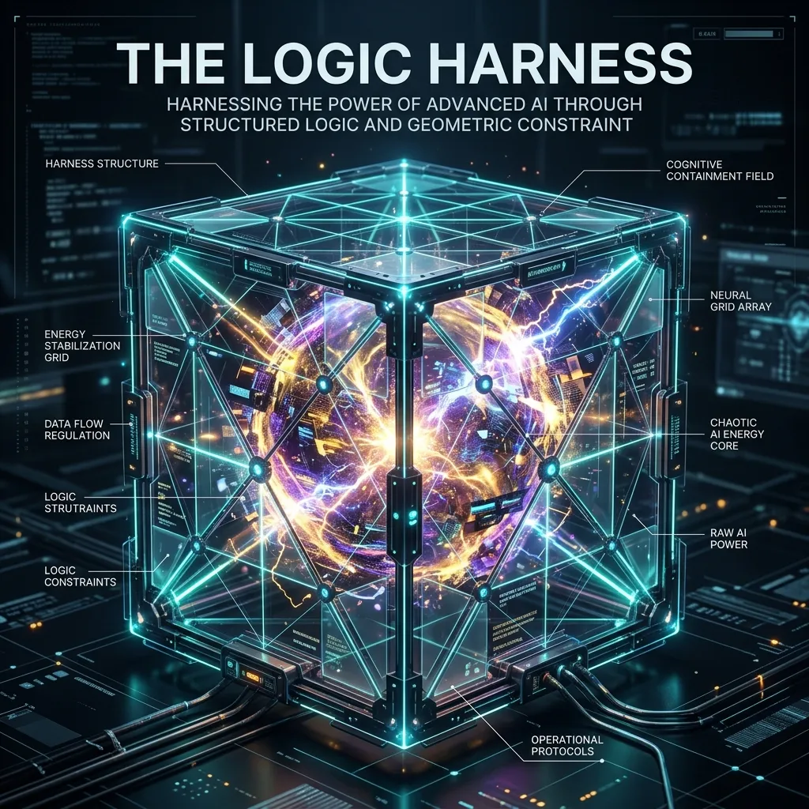

# Antigravity Protocol 2.0: The Advanced Engineering Series

> **"From Stochastic Vibes to Deterministic Foundations."**

Welcome to the official repository of the **Antigravity Protocol v2.0**. This project documents the complete evolution of "Vibe Coding"—the process of building software through large language models—into a rigorous, professional engineering discipline. 

This repository serves as the primary source for the upcoming technical series and book publication on **Agentic Engineering Foundations**.

---

## 🚀 The Vision: Phase 1 (Hyper-Deep v4.1)

In the initial development phase, we establish the three fundamental pillars required for reliable, autonomous AI agents. Unlike standard high-speed prototypes, these specifications (v4.1 Hyper-Deep) represent the maximum technical fidelity required for mission-critical software.

### 🖋️ Index of Technical Specifications

#### [Section 01: The Logic Harness — Mathematics of Truth](https://github.com/vibealgolab/Vibe_coding_with_Antigravity/blob/main/docs/specs/01_Logic_Harness_Part_A_Hyper_Deep_v4.1.md)
*How to transform an AI from a "Stochastic Proposer" to a "Satisfiability Solver."*
- [Part A: Foundations - Invariants & Hoare Logic](./docs/specs/01_Logic_Harness_Part_A_Hyper_Deep_v4.1.md)
- [Part B: Architecture - Z3 & Symbolic Execution](./docs/specs/01_Logic_Harness_Part_B_Architecture_v4.1_Hyper_Deep.md)
- [Part C: Implementation - Atomic Transition & Case Study](./docs/specs/01_Logic_Harness_Part_C_Hyper_Deep_v4.1.md)

#### [Section 02: AI Amnesia — The Persistent Mind](https://github.com/vibealgolab/Vibe_coding_with_Antigravity/blob/main/docs/specs/02_AI_Amnesia_Part_A_Hyper_Deep_v4.1.md)
*Designing the Hierarchical Cognitive Memory (HCM) to eliminate context decay.*
- [Part A: Foundations - Attention Entropy & HCM Theory](./docs/specs/02_AI_Amnesia_Part_A_Hyper_Deep_v4.1.md)
- [Part B: Architecture - Letta VMM & Mem0 Integration](./docs/specs/02_AI_Amnesia_Part_B_Architecture_v4.1_Hyper_Deep.md)
- [Part C: Implementation - Memory Orchestrators & Refactor Case Study](./docs/specs/02_AI_Amnesia_Part_C_Implementation_v4.1_Hyper_Deep.md)

#### [Section 03: Deterministic Guardrails — The Silicon Prison](https://github.com/vibealgolab/Vibe_coding_with_Antigravity/blob/main/docs/specs/03_Deterministic_Guardrails_Part_A_Hyper_Deep_v4.1.md)
*Deploying Zero-Trust Isolation (ZTEC) and Micro-Virtualization.*
- [Part A: Foundations - Sovereignty & EU AI Act Compliance](./docs/specs/03_Deterministic_Guardrails_Part_A_Hyper_Deep_v4.1.md)
- [Part B: Architecture - Firecracker MicroVM & OPA Policy-as-Code](./docs/specs/03_Deterministic_Guardrails_Part_B_Architecture_v4.1_Hyper_Deep.md)
- [Part C: Implementation - Action Proxies & Shell Injection Defense](./docs/specs/03_Deterministic_Guardrails_Part_C_Implementation_v4.1_Hyper_Deep.md)

---

## 🛠️ The Antigravity Engineering Protocol (AEP 2.0)

AEP 2.0 is a set of strict engineering rules designed for agents that build systems, not just code snippets.

1. **Socratic Gate**: Always verify user intent before execution.
2. **Read → Understand → Plan → Apply**: Never commit without a provable plan.
3. **Deep Modules**: Prefer hidden complexity with simple interfaces.
4. **Logic Harness (TDD)**: Every core logic transition must be mathematically verified.

---

## 📚 Future Roadmap

| Phase | Milestone | Focus |
| :--- | :--- | :--- |
| **PHASE 1** | **Core Foundations (Complete)** | Trust, Memory, and Security |
| **PHASE 2** | **The Reviewer (Next)** | Structural Metrics, Self-Healing CI/CD, and Skill Evolution |
| **PHASE 3** | **Advanced Orchestration** | Swarm Intelligence, Zero-Latency Logic, and Multi-Agent Synthesis |

---

## 🖋️ Authorship & Distribution

**VibeAlgoLab** is the primary architect and copyright holder of the Antigravity series. These documents are being prepared for future book publication. 

- **Contact**: [GitHub Repository](https://github.com/vibealgolab/Vibe_coding_with_Antigravity)
- **License**: Documentation and code in this repository are subject to professional audit and standard proprietary constraints for future publication. (Refer to LICENSE for details).

---
*Powered by Antigravity Engineering Protocol (AEP) 2.0*
