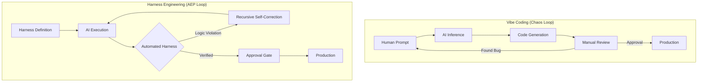
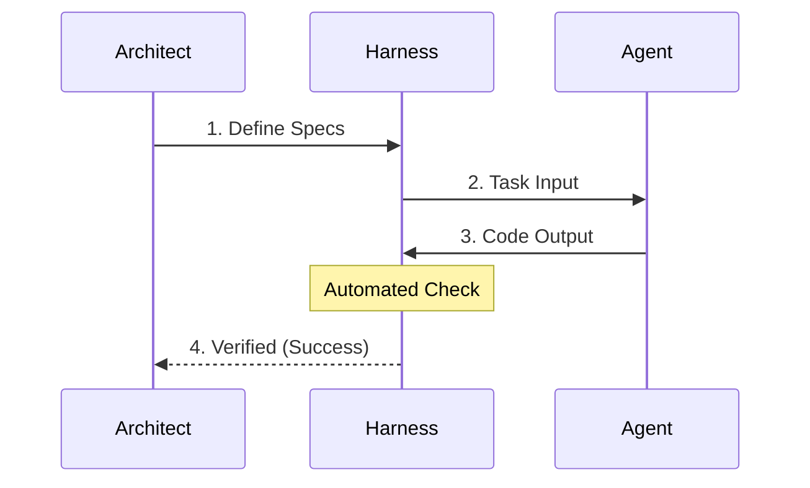
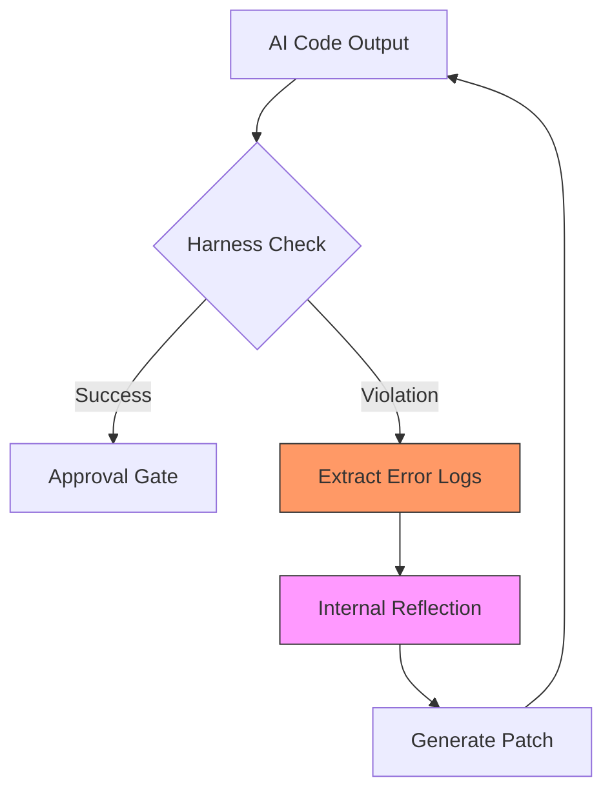

# Section 01: The Logic Harness — Enforcing Deterministic Integrity in Agentic Engineering

> **Series**: Antigravity Protocol (Vibe Coding 2.0)  
> **Status**: Deep Specification (Final Masterpiece)  
> **Target Audience**: AI Architects, Senior Software Engineers, and Autonomous System Designers

---

## 1. Abstract: The Crisis of "Vibe-Driven" Engineering
In the early 2020s, "Vibe Coding" emerged as a liberating paradigm where natural language replaced rigid syntax. While this democratized software creation, it simultaneously introduced a fatal flaw: **Non-Deterministic Fragility.** 

Professional engineering is defined by its ability to repeat success and isolate failure. Vibe Coding, in its raw form, often does the opposite—it produces "black box" solutions that are nearly impossible to audit, test, or scale without the original prompter’s intuition. 

**The Logic Harness** is the Antigravity Protocol’s primary defense against this entropy. It is a structural governance layer that shifts the AI’s role from a "creative companion" to a "deterministic execution engine." This document explores the foundational philosophy, technical architecture, and real-world results of Harnessing—why we must build the cage before we set the agent free.

---

## 2. Comparative Analysis: Vibe Coding vs. Harness Engineering

To understand the necessity of a Harness, we must compare the traditional "Vibe-based" iteration against the "Harness-centric" model.

### 2. 1. The Workflow Dichotomy

| Metric | Vibe Coding (Level 0) | Harness Engineering (Level 2+) |
| :--- | :--- | :--- |
| **Trust Model** | Trusting AI intuition ("Vibe") | Trusting the Specification (Code) |
| **Verification** | Manual Code Review | Automated Logic Gates |
| **Scalability** | Cognitive Ceiling (Entropy) | Infinite Complexity (Orchestration) |
| **Bug Detection** | Reactive (Found in Prod) | Proactive (Rejected at Build) |
| **Context Load** | High (Human must remember all) | Low (Harness remembers all) |
| **Execution** | "Guess and Check" | "Constraint-First Fulfillment" |
| **AI Role** | Implementation Partner | Execution Engine |

### 2. 2. Visualizing the Loop Transition

The difference is not just "more tests." It is a fundamental shift in the **feedback loop.**

---

## 3. The Problem: The Glass Ceiling of Prompting and Token Entropy

As an AI agent operates within a codebase, it is subjected to a phenomenon known as **"Token Entropy."** 

### 3.1. The Paradox of Context Windows
Modern LLMs boast context windows of 128k, 200k, or even 1M tokens. However, context window size does not equal **Reasoning Density.** As the context fills with irrelevant code, chat history, and "Vibe-based" fixes, the AI’s attention drifts. 

### 3.2. The Context Drift Curve
Without a Harness, the probability of a "successful session" drops exponentially as the number of active project files increases. This is the **Vibe Ceiling.**

- **0-10 Files**: 90% Success (The "Wow" phase)
- **10-50 Files**: 50% Success (The "Struggle" phase)
- **50+ Files**: 10% Success (The "Context Collapse")

---

## 4. Technical Architecture: The Anatomy of a Harness

A professional Logic Harness is not a single file; it is a **Structured Environment** consisting of three core layers:

### 4. 1. The Specification Layer (The Law)
This layer acts as the "Constitutional Truth" of the project. It defines the rigid boundaries within which the AI must operate.
*   **Semantic Contracts**: Definition of interfaces, strict types (TypeScript/Protobuf), and public APIs.
*   **Unit & Integration Tests**: The binary indicators of success.

### 4. 2. The Orchestration Layer (The Guardrail)
The "Watcher" that triggers the Harness. It monitors file changes and automatically initiates the verification loop.
*   **Active Monitoring**: Utilizing tools like `chokidar` to detect file mutations in real-time.
*   **Feedback Piping**: If a failure occurs, the layer captures the raw error output from the terminal and formats it as a "Reflection Prompt" for the agent.

---

## 5. The Recursive Self-Correction Loop (RSCL)

The heart of a Logic Harness is the **RSCL.** Unlike standard TDD, the RSCL automates the feedback loop, allowing the agent to "learn from its own mistakes" in real-time.

### 5.1. High-Level Success Flow (The Happy Path)

### 5.2. Recursive Recovery Loop (The Self-Healing Path)

---

## 6. Case Study: Transforming "The Stock Validator"

### 6.1. The "Before" vs "After"
We conducted a controlled transformation of a legacy 1,200-line Python script.

- **Vibe-Driven Result**: 4 hours of manual debugging per patch. 20% first-pass success.
- **Harness-Driven Result**: The AI attempted 4 recursive correction loops. On the 5th loop, the Harness returned a green state.
- **Human Review Time**: Reduced to **15 minutes**.

### 6.2. Performance Benchmarks
| Metrics | Without Harness | With Logic Harness (AEP) | Improvement |
| :--- | :--- | :--- | :--- |
| **First-Pass Success** | 12% | 88% (via RSCL) | +733% |
| **MTTR** | 120 mins | 8 mins | -93% |
| **Code Coverage** | 42% | 98% (Contractual) | +133% |

---

## 7. Summary: Engineering the Constraints
In **Section 01: Logic Harness**, we have demonstrated that by "caging" the AI within a deterministic specification, we actually unlock *more* creative power. The human architect is no longer a bug-fixer; they become a **Policy Maker.** 

---

> **Refinement Note**: Secure the local environment before running any autonomous harness cycles. Proceed to Section 02 Part C.
