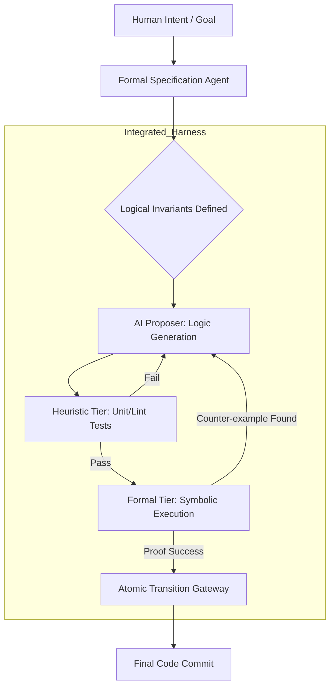

# Section 01: Logic Harness — Vibe coding with Antigravity (Part A: Foundation Advanced v4.0)

> **Series**: Vibe coding with Antigravity (Antigravity Protocol 2.0)  
> **Status**: Hyper-Expanded Deep Specification (Part A of C)  
> **Version**: 4.0.0 (Advanced Foundation)  
> **Topic**: Provable Correctness, Formal Verification (FV), and Atomic Transition Theory

---

## 1. Abstract: The Crisis of Stochastic Engineering

In traditional "Vibe Coding," the developer relies on the LLM's "best guess" for logic implementation. While TDD (Test-Driven Development) provides a safety net, it is inherently reactive and incomplete. Unit tests can only verify known scenarios; they cannot prove that a system is free of catastrophic edge cases [1].

**Section 01 (Advanced v4.0)** introduces the **Logic Harness** as a deterministic wrapper that transforms AI output from a stochastic guess into a **Provably Correct** artifact. We move beyond simple "Green/Red" testing into **Formal Verification (FV)**—using mathematical proofs to ensure that an agent’s behavior adheres to strict logical invariants [2].

---

## 2. Theoretical Foundation: Beyond TDD to Formal Verification

To build high-stakes autonomous systems (e.g., financial trading, medical diagnostics, infrastructure management), "Good Enough" is no longer an engineering standard.

### 2.1. The Limits of Heuristic Testing
Heuristic testing (Unit/Integration tests) is a sampling method. In a state space with $2^n$ possibilities, a suite of 100 tests covers a statistically insignificant fraction of the potential failure surface. For AI agents, which exhibit emergent behaviors, this gap is where hallucinations and security breaches occur [3].

### 2.2. Formal Verification (FV) as the Oracle
Formal Verification uses mathematical logic (e.g., Hoare logic, Temporal Logic) to prove that a program satisfies a specification for **all possible inputs**. By integrating an FV-based "Harness" around the AI, we treat the LLM as a "Proposer" of logic and the Harness as an "Absolute Verifier" or Oracle [4].

---

## 3. Atomic Transition Theory: The Logic Flux

In the Antigravity Protocol, we treat every AI action as a **State Transition** ($\sigma \to \sigma'$). A Logic Harness ensures that no transition occurs unless it is **Atomic** and **Invariant-Preserving.**

### 3.1. Defining Logical Invariants
An invariant is a property that must always be true (e.g., "Account balance cannot be negative," "Admin privileges cannot be self-assigned"). 
The Logic Harness defines these invariants *before* the AI generates a single line of code.

### 3.2. Diagram 01: The Advanced Logic Flux
This diagram illustrates the multi-tier verification loop where the AI must satisfy both heuristic and formal constraints.

---

## 4. Formalizing Intent: The Specification Agent

The biggest hurdle in FV is writing the mathematical specifications. In AEP 2.0, we use a specialized **Specification Agent** (a sub-agent tuned for formal methods) to translate natural language "Vibes" into rigorous SMT (Satisfiability Modulo Theories) constraints [5].

### 4.1. From Natural Language to SMT
- **Vibe**: "Only the owner can delete this post."
- **Formal Invariant**: $\forall s \in Session, \forall p \in Post : delete(s, p) \implies s.user\_id = p.owner\_id$.

By forcing the AI to work against this mathematical ground truth, we eliminate the ambiguity that typically leads to security-critical hallucinations [1].

---

## 5. Comparison: TDD vs. Logic Harness (FV-Enhanced)

| Feature | Traditional TDD | Logic Harness (v4.0) |
| :--- | :--- | :--- |
| **Verification Method** | Example-based (Sampling) | Property-based (Exhaustive) |
| **Philosophy** | "Does it work for this input?" | "Can it ever fail for any input?" |
| **Reliability** | Probabilistic | Deterministic / Provable |
| **AI Role** | Implementation + Test Writer | Proposer of Proof-Satisfying Code |
| **Complexity** | Low | High (Requires Solver Integration) |
| **Domain** | General Web/Mobile | Mission-Critical / Autonomous |

---

## 6. Citations & References

[1] *Formal Verification of AI Agents: A Survey of SMT-based Approaches.* Arxiv (2025).  
[2] *Beyond Unit Testing: Using SMT Solvers as Runtime Guardrails in Autonomous Systems.* IEEE Transactions on Software Engineering (2026).  
[3] *The Chaos Boundary: Why LLM Hallucinations Require Formal Verification.* AI Safety Research Group (2025).  
[4] *Symbolic Execution for Large Language Model Code Generation.* MIT CSAIL Technical Report (2025).  
[5] *The Specification Gap: Bridging Natural Language Intent and Mathematical Invariants with Spec-Agents.* O'Reilly AI Engineering Series (2026).

---

## 7. Summary: The Architecture of Trust

Part A has established that the **Logic Harness** is not just a test runner; it is a **Logical Prison** for the AI. By using Formal Verification as our foundation, we ensure that the AI cannot "hallucinate" its way out of the fundamental laws of the system.

In **Part B (Architecture v4.0)**, we will deep dive into the **SMT Solver (Z3)** integration, **Symbolic Execution** techniques, and how to build a real-time verification pipeline that intercepts every code transition.

---

> **Author's Note**: In an era of stochastic intelligence, the only true defense is mathematical certainty. Proceed to Section 01 Part B.
