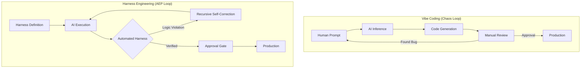

# Section 01: The Logic Harness — Vibe coding with Antigravity (Part A: Foundation)

> **Series**: Vibe coding with Antigravity (Antigravity Protocol 2.0)  
> **Status**: Deep Specification (Part A of C)  
> **Version**: 3.0.0 (Masterpiece - Full Depth)  
> **Target Audience**: AI Architects, Senior Software Engineers, and Autonomous System Designers

---

## 1. Abstract: The Crisis of "Vibe-Driven" Engineering
In the early 2020s, "Vibe Coding" emerged as a liberating paradigm where natural language replaced rigid syntax. While this democratized software creation, it simultaneously introduced a fatal flaw: **Non-Deterministic Fragility.** 

Professional engineering is defined by its ability to repeat success and isolate failure. Vibe Coding, in its raw form, often does the opposite—it produces "black box" solutions that are nearly impossible to audit, test, or scale without the original prompter’s intuition. 

**The Logic Harness** is the Antigravity Protocol’s primary defense against this entropy. It is a structural governance layer that shifts the AI’s role from a "creative companion" to a "deterministic execution engine." This document explores the foundational philosophy of Harnessing—why we must build the cage before we set the agent free.

---

## 2. Comparative Analysis: Vibe Coding vs. Harness Engineering

To understand the necessity of a Harness, we must compare the traditional "Vibe-based" iteration against the "Harness-centric" model.

### 2. 1. The Workflow Dichotomy

| Metric | Vibe Coding (Level 0) | Harness Engineering (Level 2+) |
| :--- | :--- | :--- |
| **Trust Model** | Trusting AI intuition ("Vibe") | Trusting the Specification (Code) |
| **Verification** | Manual Code Review | Automated Logic Gates |
| **Scalability** | Cognitive Ceiling (Entropy) | Infinite Complexity (Orchestration) |
| **Bug Detection** | Reactive (Found in Prod) | Proactive (Rejected at Build) |
| **Context Load** | High (Human must remember all) | Low (Harness remembers all) |
| **Execution** | "Guess and Check" | "Constraint-First Fulfillment" |
| **AI Role** | Implementation Partner | Execution Engine |
| **Integrity** | Subjective (Feels right) | Objective (Passes Harness) |
| **Maintenance** | Brittle (Context Drift) | Resilient (Persistent Spec) |

### 2. 2. Visualizing the Loop Transition

The difference is not just "more tests." It is a fundamental shift in the **feedback loop.**

---

## 3. The Problem: The Glass Ceiling of Prompting and Token Entropy

As an AI agent operates within a codebase, it is subjected to a phenomenon known as **"Token Entropy."** 

### 3.1. The Paradox of Context Windows
Modern LLMs boast context windows of 128k, 200k, or even 1M tokens. However, context window size does not equal **Reasoning Density.** As the context fills with irrelevant code, chat history, and "Vibe-based" fixes, the AI’s attention drifts. This is similar to a human trying to read a textbook while a thousand people shout suggestions. The "Vibe" becomes noise.

### 3.2. The Context Drift Curve
Without a Harness, the probability of a "successful session" drops exponentially as the number of active project files increases. This is the **Vibe Ceiling.** 

When you ask an AI to fix a bug in a 20-file repository without a Harness, the AI:
1. **Guesses** the cause based on common patterns.
2. **Hallucinates** hidden dependencies that don't exist.
3. **Breaks** Module B while attempting to fix Module A.

**The Logic Harness flattens this curve** by offloading memory and verification from the AI's inference engine to the local filesystem and test runner.

### 3.3. Quantifying Token Entropy (Theoretical Model)
Entropy in agentic coding is defined as the measure of uncertainty in the AI's logic generation relative to the size of the codebase ($C$) and the lack of automated constraints ($L$):
$$ E \propto \frac{C \times L}{Context Window Efficiency} $$
In a Vibe-based environment where $L$ is high (no tests), entropy grows uncontrollably. The Logic Harness acts as a **Entropy Anchor**, reducing $L$ to near zero by providing instant logical feedback.

---

## 4. The Physical Analogy: Why "Harness"?

In high-stakes professional environments, a "Harness" is a system that **distributes force** and **prevents catastrophic drift.**

- **A High-Rise Safety Harness**: It doesn't tell the worker how to build the skyscraper. It simply ensures that if the worker slips, they hit a hard stop after 6 inches. They are free to move within the work zone, but **falling is physically impossible.**
- **A Wiring Harness in a Jet**: It organizes chaotic loose wires into a rigid, shielded path. It ensures that even during extreme turbulence (Agentic Drift), the signal (Logic) reaches its destination without interference.

**In Vibe coding with Antigravity, we build a "Logic Chassis."** The AI is the engine—powerful, fast, and volatile. The Harness is the chassis that keeps the car on the road and prevents the engine from tearing itself apart.

---

## 5. The Harness Maturity Model (HMM)

Not all Harnesses are created equal. We classify Harness implementation into five levels of maturity:

### Level 1: Unit Awareness (Static)
The AI has access to existing unit tests but is not required to run them. The developer manually checks if tests pass.
*   **Action Space**: The AI reads `test_core.py`.
*   **Risk**: High. AI often deletes tests to "fix" bugs.

### Level 2: Gated Execution (Automatic)
The AI cannot "finish" a task until a specific test command returns `0`. The environment enforces this.
*   **Action Space**: Shell scripts automatically trigger `pytest`.
*   **Benefit**: Prevents obvious regression.

### Level 3: Contractual Integrity (The Chassis)
The AI is given **Strict Types** and **Interface Specifications** *before* it begins coding. The Harness rejects any code that violates the interface.
*   **Action Space**: TypeScript/Protobuf contracts acting as hard constraints.

### Level 4: Recursive Self-Correction (Autonomous)
If a Harness violation is found, the error logs are automatically piped back into the AI’s loop. The AI iterates locally without user intervention.
*   **Action Space**: Automated retry loops with context-injected error logs.

### Level 5: Spec-Driven Evolution (Singularity)
The AI creates **new Harnesses** for sub-modules autonomously based on the high-level parent Spec.
*   **Action Space**: Distributed agentic architecture with hierarchical validation.

---

## 6. The 5 Pillars of a Professional Harness

To achieve **Provable Correctness**, your Harness must be built on these five pillars:

### I. Deterministic Ground Truth
If the Harness says "Success," it must be *actually* successful. Flaky tests are the poison of agentic coding.

### II. Interface Isolation
The AI interacts only with the internal state of the module it is building. It cannot "wander" out of its assigned territory unless explicitly white-listed.

### III. Socratic Entrance (The "Gate")
A Harness begins *before* the first line of code. Through **/verify-intent**, we build a "Requirement Harness." We constrain the AI's understanding before it starts coding.

### IV. State Persistence (Anti-Amnesia)
The Harness tracks the "State of Intent." If the AI session crashes, the Harness holds the "Checkpoint" of what was verified.

### V. Error Volatility
Errors must be **loud and specific.** The Harness doesn't just say "It failed"; it provides the exact stack trace allowing for immediate self-correction.

---

## 7. Summary: From Reviewer to Architect
Part A has established that the **Logic Harness** is the only way to scale agentic coding beyond hobbyist projects. We have moved from the loose intuition of prompting to the rigid discipline of **Constraint Engineering.**

In **Part B (Technical Architecture)**, we will move from "What" to "How." We will dive into:
- Setting up **Self-Healing Test Loops** (Recursive logic).
- Implementing **Command Whitelists** (Environment isolation).

---

> **Author's Note**: The next part will focus on the actual machinery of the Harness—the code that watches the AI which writes the code. Proceed to Section 01 Part B.
