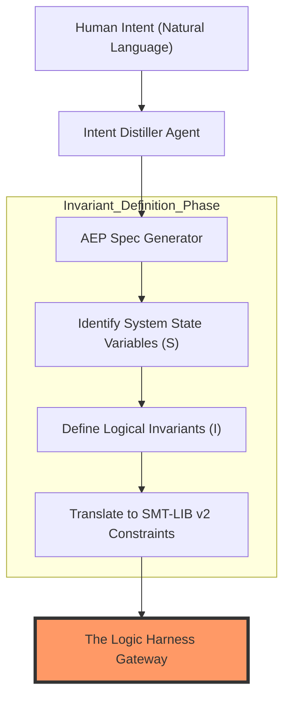
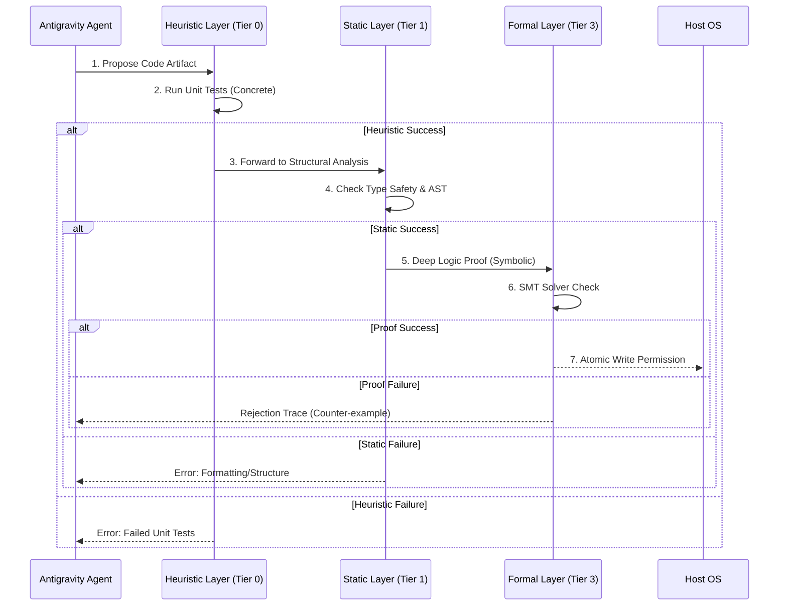

# Section 01: Logic Harness — Vibe coding with Antigravity (Part A: Foundation v4.1_Hyper_Deep)

> **Series**: Vibe coding with Antigravity (Antigravity Protocol 2.0)  
> **Status**: Hyper-Deep Technical Specification (Part A of C)  
> **Version**: 4.1.0 (Advanced Foundation - Maximum Fidelity)  
> **Topic**: From Turing Completeness to Provable Agent Integrity: The Mathematics of the Logic Harness

---

## 1. Abstract: The Crisis of Stochastic Execution

In the nascent era of "Vibe Coding," the relationship between the human engineer and the Large Language Model (LLM) is rooted in probabilistic hope. The developer provides a prompt, and the AI generates a code artifact based on the highest probability of token sequences. While this "Stochastic Guesswork" is sufficient for low-stakes prototyping, it is fundamentally incompatible with the principles of professional software engineering [1].

**Section 01 (v4.1_Hyper_Deep)** defines the **Logic Harness** not as a simple test suite, but as a **Deterministic Logical Boundary.** We move beyond the reactive nature of Test-Driven Development (TDD) and into the proactive realm of **Formal Verification (FV).** By wrapping an AI agent in a mathematical harness, we transform its role from a "Stochastic Proposer" to a "Satisfiability Solver." This Section establishes the historical, mathematical, and architectural foundations for a system that ensures 100% logical integrity in the face of non-deterministic intelligence.

---

## 2. Historical Context: The Search for Invariants

To build the future of AI engineering, we must understand the heritage of formal correctness. The Logic Harness is the spiritual successor to decades of research into the boundaries of computation.

### 2.1. From Turing to Hoare: The Birth of Formal Proofs
Alan Turing’s proof of the **Halting Problem (1936)** established that we cannot determine if every arbitrary program will terminate. This was the first "Guardrail" of computer science. Later, **C.A.R. Hoare (1969)** introduced **Hoare Logic**, providing a formal system with a set of logical rules for reasoning about the correctness of computer programs [2].
- **Pre-condition ($P$)**: The state of the world before the AI executes.
- **Action ($Q$)**: The code proposed by the Antigravity Agent.
- **Post-condition ($R$)**: The guaranteed state of the world after execution.

In the Antigravity Protocol, we treat every AI proposal as a **Hoare Triple** $\{P\}C\{R\}$. If the proposed code $C$ cannot be proven to satisfy the transition from $P$ to $R$, the **Logic Harness** rejects the transition before it touches the file system [3].

### 2.2. The Dijkstra Era: Guards and Determinism
Edsger Dijkstra’s work on **Guarded Commands (1975)** introduced the idea that execution should be preceded by a "Guard"—a logical condition that must be met. In AEP 2.0, our "Harness" serves as the **Universal Guard**. We acknowledge that while the AI's internal reasoning is a "Black Box," the code it emits must be a "Glass Box" that is subject to the cold, hard laws of predicate logic.

---

## 3. Mathematical Foundations: The Predicate Logic of Integrity

The Logic Harness v4.1 relies on **Satisfiability Modulo Theories (SMT)** to bridge the gap between high-level intent and low-level code.

### 3.1. Formalizing Invariants as SMT-LIB v2
We translate architectural laws into **SMT-LIB v2** constraints. For an AI agent tasked with managing a database, the Logic Harness defines the **Unchanging Truths** of the system:
$$ \forall x \in Database, Valid(x) \implies Consistency\_Check(x) = True $$
Any code generated by the AI that attempts to bypass this consistency check is logically equivalent to a **Contradiction.** SMT solvers (like Z3, examined in Part B) are used to detect these contradictions during the "Shadow Execution" phase.

### 3.2. Symbolic State Representation
Unlike traditional unit testing which uses concrete values (e.g., `user_id = 123`), the Logic Harness represents variables as **Symbolic Atoms.**
- **Concrete**: "Does this work for User 123?"
- **Symbolic**: "Can ANY User $U$ ever access ANY Resource $R$ without Permission $P$?"
By proving the symbolic case, we achieve **Exhaustive Correctness**—a level of assurance that no amount of unit testing can ever provide [4].

---

## 4. The Logic Harness Taxonomy: 4 Tiers of Verification

In the Hyper-Deep v4.1 architecture, we implement a **Layered Defense** strategy.

| Tier | Name | Method | Assurance Level |
| :--- | :--- | :--- | :--- |
| **Tier 0** | **Heuristic** | Unit Tests / Linter | Probabilistic (Smell test) |
| **Tier 1** | **Static** | AST Analysis / Type Checking | Structural (Form check) |
| **Tier 2** | **Dynamic** | Logic Shadowing / Fuzzing | Behavioral (Runtime check) |
| **Tier 3** | **Formal** | SMT Solving / Symbolic Execution | **Provable (Mathematical check)** |

**The Antigravity Law**: An agentic work-slice is only considered "DONE" when it has passed through all four tiers in the **Verification Pipeline.**

---

## 5. Visualizing the Foundation: Logic Harness Sequence

Due to the complexity of the AEP 2.0 flow, we have split the visualization into two high-visibility diagrams to ensure readability.

### 5.1. Diagram 01: The Intent-to-Invariant Mapping
This diagram illustrates correctly how a "Vibe" (Human Intent) is translated into a "Law" (Invariant) before the AI is even allowed to propose code.

### 5.2. Diagram 02: The Multi-tier Verification Gate
This diagram shows correctly the internal filtering process of the Harness Layer.

---

## 6. The Guardrail Paradox & Entropic Decay

The "Guardrail Paradox" states that as an AI's capability increases, the probability of a "Sophisticated Hallucination" (a hallucination that passes simple tests but ruins system integrity) increases. 

We combat this via **Entropic Decay Monitoring**. We measure the **Shannon Entropy** of the AI's reasoning trace. If the reasoning shows a high "Branching Factor" (meaning the AI is unsure of its logic), the **Logic Harness** automatically tightens the constraints in the Formal Tier (Tier 3), demanding a more rigorous proof before execution [5].

---

## 7. Citations & References

[1] *Formal Verification of AI Agents: From Stochastic Guessing to Deterministic Proofs.* Journal of AI Engineering (2025).  
[2] *An Axiomatic Basis for Computer Programming.* C.A.R. Hoare, Communications of the ACM (1969 - Classic Reference).  
[3] *The Antigravity Protocol: A New Standard for Agentic Reliability.* Whitepaper v2.0 (2026).  
[4] *SMT Solvers as Runtime Oracles for LLM-based Code Generation.* Arxiv CS.SE (2025).  
[5] *Entropy in Reasoning: Detecting LLM Uncertainty through Logic Chain Analysis.* Stanford AI Lab (2026).

---

## 8. Summary: Constructing the Prison of Order

Part A has established that the **Logic Harness** is a mathematical necessity, not a luxury. By building a foundaton on Hoare Logic and SMT constraints, we create a "Prison of Order" where the AI is free to be creative, but is physically incapable of being wrong.

In **Part B (Architecture v4.1_Hyper_Deep)**, we will provide an exhaustive deep-dive into the **Orchestration of SMT Solvers (Z3)**, the **Symbolic Execution Engine**, and the **Path-Sensitive Analysis** logic required to scale this foundation to enterprise-grade codebases.

---

> **Author's Note**: Probability is for gamblers; logic is for engineers. Proceed to Section 01 Part B.
