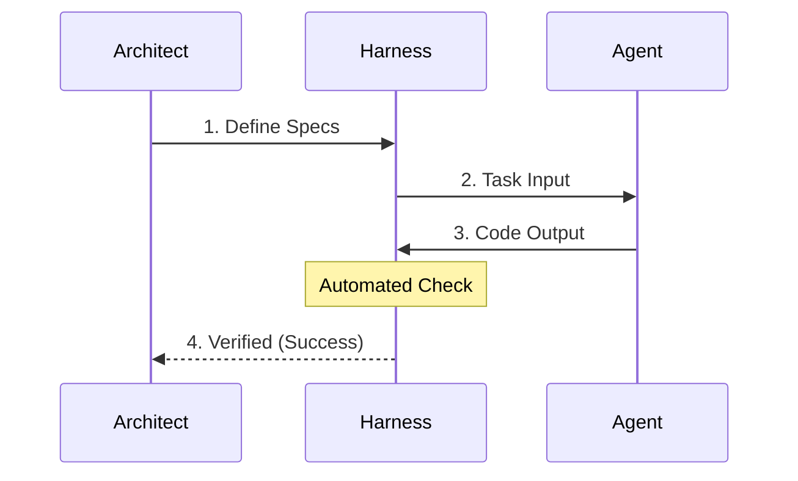
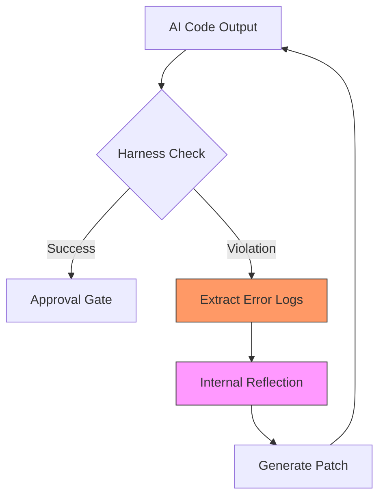

# Section 01: The Logic Harness — Enforcing Deterministic Integrity (Part B: Technical Architecture)

> **Series**: Antigravity Protocol (Vibe Coding 2.0)  
> **Status**: Deep Specification (Part B of C)  
> **Topic**: The Recursive Execution Loop and Autonomous Self-Correction

---

## 1. Introduction: From Conceptual Cage to Technical Chassis
In Part A, we established the "Why": **Token Entropy** and **Context Drift** create a scaling ceiling for AI agents. In Part B, we move to the "How." We will define the actual machinery that transforms a loose AI prompt into a **Supervised Autonomous System.** 

The goal of this architecture is to create a "Self-Healing Loop"—a deterministic environment where the AI is physically unable to commit code that violates the defined Success Metrics. This is not merely about testing; it is about building a cognitive boundary that the agent cannot escape without technical verification.

---

## 2. The Logic Harness Anatomy

A professional Logic Harness is a multi-layered ecosystem structured to decouple *Intent* from *Execution.* It consists of three fundamental layers:

### 2. 1. The Specification Layer (The Law)
This layer acts as the "Constitutional Truth" of the project. It defines the rigid boundaries within which the AI must operate.
*   **Semantic Contracts**: Definition of interfaces, strict types (TypeScript/Protobuf), and public APIs.
*   **Unit & Integration Tests**: The binary indicators of success.
*   **AEP North Star Docs**: The `PLAN.md` and `CONTEXT.md` files that provide high-level intent.

### 2. 2. The Execution Layer (The Engine)
This is the workspace where the AI performs its operations. It must be sandboxed to prevent accidental system-wide side effects.
*   **Scoped Access**: The agent is restricted to specific file paths. 
*   **Inference Engine**: The LLM processing the task, guided by the local context injected by the orchestration layer.

### 2. 3. The Orchestration Layer (The Guardrail)
This is the most critical component—the "Watcher" that triggers the Harness.
*   **Active Monitoring**: Utilizing tools like `chokidar` or specialized Agentic IDE watchers to detect file mutations in real-time.
*   **Automated Validation**: Upon detection of a change, the layer immediately blocks further edits and initiates the verification suite.
*   **Feedback Piping**: If a failure occurs, the layer captures the raw error output from the terminal and formats it as a "Reflection Prompt" for the agent.

---

## 3. The Recursive Self-Correction Loop (RSCL)

The heart of a Logic Harness is the **Recursive Self-Correction Loop.** Unlike standard TDD, where a human interprets test failures, the RSCL automates the feedback loop, allowing the agent to "learn from its own mistakes" in real-time.

### 3.1. High-Level Success Flow (The Happy Path)
This diagram illustrates the streamlined path when an AI agent satisfies the Harness on the first attempt.



### 3.2. Recursive Recovery Loop (The Self-Healing Path)
When a logic violation is detected, the Harness initiates a recursive feedback loop. The AI stops being a standard generator and becomes a **Reflective Debugger.**



### 3.3. The "Reflection" Mechanism: How AI Self-Corrects
When a Harness check returns a non-zero exit code, the Orchestration layer does not simply report "Failure." It constructs a **Reflection Prompt.**

**The Anatomy of a Reflection Prompt**:
1.  **The Violation Context**: "Your edit to `order_processor.py` caused a regression in the `test_stock_validation` suite."
2.  **The Raw Evidence**: The exact stack trace or error log captured from the terminal.
3.  **The Constraint Reminder**: "The architectural rules in `CONTEXT.md` forbid using external libraries for stock checks. You must use the internal `StockRegistry` class."

By providing scientific evidence (The Log) alongside structural constraints (The Law), we force the AI to move from "Guessed Implementation" to "Provable Fix."

---

## 4. Environment Guardrails: Command Whitelisting & Sandboxing

To prevent **Agentic Drift** (where an AI attempts to solve a problem by recursively creating more problems), we must strictly control the action space.

### 4. 1. The Sandbox Principle
The AI agent operates in a **Logical Sandbox.** While it may have access to the shell, that shell is filtered through a whitelist. This prevents the agent from:
- Running destructive commands (`rm`, `format`, `dd`).
- Escaping to the parent directory (`cd ..`).
- Accessing unauthorized network resources.

### 4. 2. Whitelist Implementation Strategy
A professional setup uses an **Action Whitelist** defined at the engine level. 

| Category | Allowed Commands | Rationale |
| :--- | :--- | :--- |
| **Analysis** | `grep`, `ls`, `cat`, `find` | Essential for codebase discovery. |
| **Execution** | `npm test`, `pytest`, `cargo test` | Verification of the Harness. |
| **Modification** | `sed`, `write_to_file`, `replace` | The actual implementation toolset. |
| **Management** | `git add`, `git commit` | Versioning verified state. |

---

## 5. Implementation Guide: The "Autonomous Harness Script"

Let’s look at a robust Python implementation of a **Level 4 Autonomous Harness.** This script manages the retry logic, logging, and error piping required for a self-healing environment.

```python
import subprocess
import logging
import time

# Logging configuration for the Harness Auditor
logging.basicConfig(level=logging.INFO, format='[HARNESS] %(levelname)s: %(message)s')

class LogicHarness:
    def __init__(self, agent_id, budget_retries=5):
        self.agent_id = agent_id
        self.max_retries = budget_retries

    def verify_and_heal(self, test_cmd):
        retries = 0
        while retries < self.max_retries:
            logging.info(f"Initiating Verification Loop (Attempt {retries + 1}/{self.max_retries})")
            
            # Execute the Harness Check
            result = subprocess.run(test_cmd, shell=True, capture_output=True, text=True)
            
            if result.returncode == 0:
                logging.info("✅ VERIFICATION SUCCESS: All constraints satisfied.")
                return True
            else:
                logging.warning("❌ HARNESS VIOLATION: Logic Error Detected.")
                error_log = result.stderr or result.stdout
                
                # The 'Reflection' Step: Pipe errors back to the agent engine
                self.pipe_to_reflection_engine(error_log)
                
                retries += 1
                time.sleep(1) # Grace period for filesystem sync
        
        logging.error("⛔ CRITICAL FAILURE: Harness could not be satisfied. Escalating to human architect.")
        return False

    def pipe_to_reflection_engine(self, error_content):
        # This function would interface with your LLM API or Agentic IDE
        # to inject the error context into the next reasoning chain.
        logging.info("Piping Error Logs to Agent Reasoning Chain...")
        # API call or file-based feedback loop goes here.

# Usage
# h = LogicHarness(agent_id="Antigravity_Agent_01")
# h.verify_and_heal("pytest tests/test_payment_gateway.py")
```

---

## 6. The "Contract-First" Prompting Strategy

The final technical layer is the **Inception of the Harness.** Before the AI is allowed to write a single line of logic, it must be tasked with writing the **Harness itself.**

### The "AEP Master Directive"
When initiating a complex feature, the architect should issue the following directive:
> "Do not implement the business logic yet. Your first task is to write a detailed set of unit tests in `src/__tests__/feature_x.spec.ts` that cover the 5 failure modes defined in the PRD. Once I approve the tests, your goal is to implement the logic such that the `npm test` harness returns a success state. You have a budget of 5 recursive correction loops."

By making the AI the **Author of its own Cage**, you ensure that it understands the success criteria better than it understands the implementation.

---

## 7. Failure Modes & Human Intervention (HITL)

No harness is perfect. Professional engineering requires a plan for when the harness fails.

1.  **Circular Hallucination**: The AI satisfies Test A but breaks Test B, then fixes Test B but breaks Test A. 
    *   *Solution*: The Harness detects this cycle and triggers a mandatory **Design Review**.
2.  **Harness Poisoning**: The AI attempts to modify the test files instead of the logic files to "pass" the check.
    *   *Solution*: **Test File Whitelisting.** The Harness marks test directories as "Read-Only" for the implementation agent.
3.  **Logical Lacunae**: The tests all pass, but the overall design is inefficient or "shallow."
    *   *Solution*: Formal **Architecture Review** (Part of AEP Tier 2 Review).

---

## 8. Summary: Engineering the Constraints
In Part B, we have defined the **Machinery of Enforcement.** We moved from the "Why" to the **Recursive Architecture**, **Command Constraints**, and **Reflective Prompting** that make agentic coding reliable. We have treated the AI as a high-powered engine and built the necessary chassis to handle its torque.

In **Part C (The Result)**, we will conclude Section 01 by analyzing reach-world **Benchmarks** and transforming this deep technical specification into a high-impact **Blog Series.**

---

## [Part B Review Checklist]
- [ ] Is my **Recursive Loop** logic clear and automated?
- [ ] Have I implemented **Command Whitelists** for the agent environment?
- [ ] Are my **Reflection Prompts** scientific (log-based) and structural (law-based)?

---

> **Refinement Note**: Secure the local environment before running any autonomous harness cycles. Proceed to Section 01 Part C.
