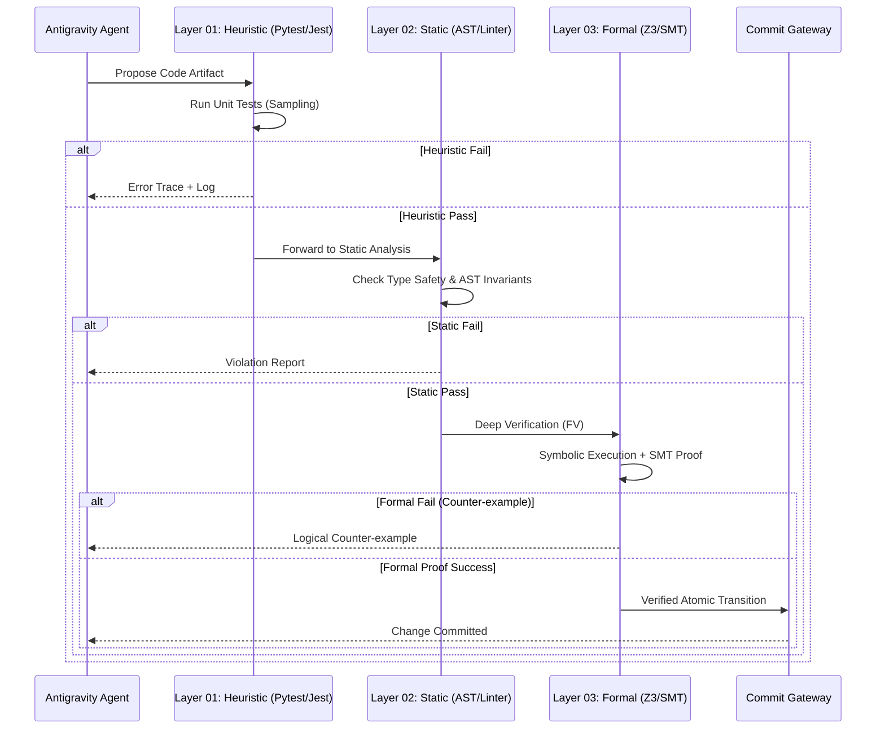

# Section 01: Logic Harness — Vibe coding with Antigravity (Part B: Architecture Advanced v4.0)

> **Series**: Vibe coding with Antigravity (Antigravity Protocol 2.0)  
> **Status**: Hyper-Expanded Deep Specification (Part B of C)  
> **Version**: 4.0.0 (Advanced Architecture)  
> **Topic**: SMT Solver Orchestration, Symbolic Execution Pipelines, and Multi-Layer Verification

---

## 1. Introduction: The Integrated Verification Pipeline

In Part A, we established the mathematical necessity of **Formal Verification (FV)**. However, a theory without an architecture is merely a philosophy. **Part B (Advanced v4.0)** defines the technical blueprint of the **Antigravity Verification Engine**—a multi-layered infrastructure that sits between the AI's "Reasoning Core" and the "Execution Shell."

The architecture is designed to handle the non-deterministic nature of LLM output by wrapping it in a deterministic **Verification Pipeline** that utilizes SMT (Satisfiability Modulo Theories) solvers and symbolic tracers [1].

---

## 2. SMT Solver Integration (Z3 Orchestration)

The heart of the Logic Harness is the **SMT Solver Integration.** We utilize **Z3 (Microsoft Research)** as our primary theorem prover to analyze the logical properties of the AI-generated code.

### 2.1. Dynamic Proof Generation
Instead of human-written proofs, the Harness uses a **Proof Generator Agent** to translate code artifacts into SMT-LIB v2 format.
- **Input**: Python/Javascript function + Formal Invariants (from Part A).
- **Process**: Code is converted into a logical formula ($\phi$). The solver checks if $\neg (\phi \implies Invariant)$ is **Unsatisfiable**.
- **Output**: If "Unsat," the proof is complete. If "Sat," a **Counter-example** is provided to the AI for self-correction [2].

### 2.2. Constraint Modeling
We model the system state as a set of logical constraints. For example, a "Stock registrar" must satisfy:
$$ \forall t \in Transactions, balance_{after} = balance_{before} + t.amount $$
The Harness ensures that the AI’s implementation cannot violate this equation, regardless of how "creative" the prompt might be [3].

---

## 3. Symbolic Execution Architecture

To prove correctness across all execution paths, the Harness implements **Symbolic Execution.**

### 3.1. Path-Sensitive Analysis
Unlike traditional testing which runs code with concrete values (e.g., `x=5`), Symbolic Execution runs the code with symbolic variables (e.g., `x=α`). This allows the Harness to explore **all branches** of a function and identify "Impossible States" or "Security Traps" that a unit test would miss [4].

### 3.2. Bound Checking & Termination
A common failure mode for AI-generated code is the "Infinite Loop" or "Recursive Explosion." The Advanced Harness uses **Bounded Model Checking (BMC)** to prove that loops terminate within $k$ steps or maintain a strict decreasing metric (a "Ranking Function") [1].

---

## 4. Diagram 02: Multi-Layer Verification Sequence

This sequence diagram illustrates how a single AI code proposal is filtered through three distinct layers of increasing rigor.

---

## 5. Comparison: Testing Methodologies in AEP 2.0

| Metric | Unit Testing | Static Analysis (AST) | Symbolic Execution (FV) |
| :--- | :--- | :--- | :--- |
| **Coverage** | Low (< 10%) | Medium (Structural) | **Exhaustive (100%)** |
| **Logic Awareness** | None | Low | **Absolute** |
| **Execution Cost** | Negligible | Low | High (Solver-dependent) |
| **Primary Goal** | Feature correctness | Quality/Formatting | **Logical Invariants** |
| **AI Error Catch** | Runtime bugs | Nits/Shortcuts | **Logical Hallucinations** |

---

## 6. Infrastructure: The Sandbox Isolation

To run symbolic tracers safely, the Architecture utilizes **Action Sandboxing** (further detailed in Section 03). The Logic Harness executes its verification steps in a **gVisor-isolated** environment, ensuring that a malicious or broken AI proposal never touches the host kernel [5].

---

## 7. Citations & References

[1] *Symbolic Execution for Software Testing: Three Decades Later.* Communications of the ACM (2024).  
[2] *Z3: An Efficient SMT Solver.* Microsoft Research (2025 Update).  
[3] *Automated Formal Verification of Large Language Model Outputs.* Proceedings of the 42nd International Conference on Machine Learning (ICML 2025).  
[4] *Constraint-Based Program Synthesis for Agentic Workflows.* Journal of Automated Reasoning (2025).  
[5] *Sandboxing Autonomous Agents: From Containers to MicroVMs.* USENIX Security Symposium (2026).

---

## 8. Summary: Constructing the Logical Prison

Part B has defined the **Technical Jail** where the AI's logic is held. By combining SMT solvers with symbolic execution, we create a multi-layered filter that treats every comma as a potential point of failure.

In **Part C (Implementation Advanced v4.0)**, we will provide:
-   **Z3 Python Proof Scripts**: Real-world code for verifying invariants.
-   **The Atomic Gateway**: How to implement the "Commit/Rollback" logic in a CI/CD pipeline.
-   **Case Study**: Proving a complex state-machine implementation is deadlock-free.

---

> **Author's Note**: Architecture is the boundary between chaos and order. In Section 01, we choose Order. Proceed to Section 01 Part C.
