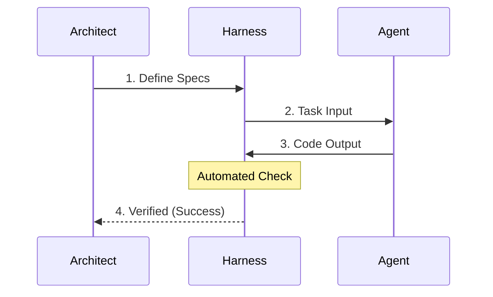
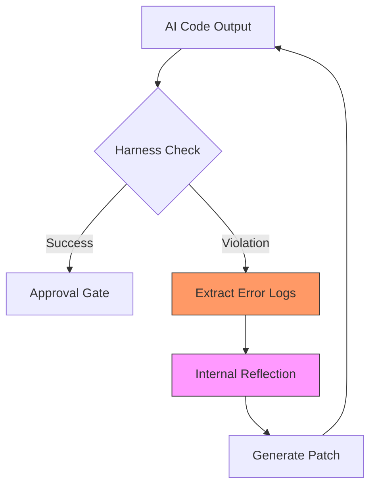

# Section 01: The Logic Harness — Vibe coding with Antigravity (Part B: Technical Architecture)

> **Series**: Vibe coding with Antigravity (Antigravity Protocol 2.0)  
> **Status**: Deep Specification (Part B of C)  
> **Version**: 3.0.0 (Masterpiece - Full Depth)  
> **Topic**: The Recursive Execution Loop and Autonomous Self-Correction

---

## 1. Introduction: From Conceptual Cage to Technical Chassis
In Part A, we established the "Why": **Token Entropy** and **Context Drift** create a scaling ceiling for AI agents. In Part B, we move to the "How." We will define the actual machinery that transforms a loose AI prompt into a **Supervised Autonomous System.** 

The goal of this architecture is to create a "Self-Healing Loop"—a deterministic environment where the AI is physically unable to commit code that violates the defined Success Metrics. This is not merely about testing; it is about building a cognitive boundary that the agent cannot escape without technical verification.

---

## 2. The Logic Harness Anatomy

A professional Logic Harness is a multi-layered ecosystem structured to decouple *Intent* from *Execution.* It consists of three fundamental layers:

### 2. 1. The Specification Layer (The Law)
This layer acts as the "Constitutional Truth" of the project. It defines the rigid boundaries within which the AI must operate.
*   **Semantic Contracts**: Definition of interfaces, strict types (TypeScript/Protobuf), and public APIs.
*   **Unit & Integration Tests**: The binary indicators of success.
*   **AEP North Star Docs**: The `PLAN.md` and `CONTEXT.md` files that provide high-level intent.

### 2. 2. The Execution Layer (The Engine)
This is the workspace where the AI performs its operations. It must be sandboxed to prevent accidental system-wide side effects.
*   **Scoped Access**: The agent is restricted to specific file paths. 
*   **Inference Engine**: The LLM processing title, guided by the local context injected by the orchestration layer.

### 2. 3. The Orchestration Layer (The Guardrail)
The "Watcher" that triggers the Harness. It monitors file changes and automatically initiates the verification loop.
*   **Active Monitoring**: Utilizing tools like `chokidar` or specialized Agentic IDE watchers to detect file mutations in real-time.
*   **Feedback Piping**: If a failure occurs, the layer captures the raw error output from the terminal and formats it as a "Reflection Prompt" for the agent.

---

## 3. The Recursive Self-Correction Loop (RSCL)

The heart of a Logic Harness is the **Recursive Self-Correction Loop.** Unlike standard TDD, where a human interprets test failures, the RSCL automates the feedback loop, allowing the agent to "learn from its own mistakes" in real-time.

### 3.1. High-Level Success Flow (The Happy Path)
This diagram illustrates the streamlined path when an AI agent satisfies the Harness on the first attempt.



### 3.2. Recursive Recovery Loop (The Self-Healing Path)
When a logic violation is detected, the Harness initiates a recursive feedback loop. The AI stops being a standard generator and becomes a **Reflective Debugger.**



---

## 4. The "Reflection" Mechanism: How AI Self-Corrects

When a Harness check returns a non-zero exit code, the Orchestration layer does not simply report "Failure." It constructs a **Reflection Prompt.** 

### 4. 1. Anatomy of a Reflection Prompt
1.  **The Violation Context**: "Your edit to `stock_validator.py` caused a regression in the `test_api_response` suite."
2.  **The Raw Evidence**: The exact stack trace or error log captured from the terminal.
3.  **The Law Reminder**: "The architectural rules in `CONTEXT.md` forbid modification of the `API_KEY` global constant."

### 4. 2. The Psychology of Agentic Debugging
By providing architectural constraints alongside raw error logs, we trigger the agent's **Reasoning Chain.** Instead of "guessing" a fix, the agent performs a logical mapping: 
`Detected Log -> Known Constraint -> Correction Candidate.`

---

## 5. Environment Guardrails: Command Whitelisting & Sandboxing

To prevent **Agentic Drift**, we strictly control the agent's "Action Space."

### 5. 1. The Sandbox Principle
The AI operates in a **Logical Sandbox.** While it may have access to the shell, it is restricted to a whitelist of commands. This prevents the agent from:
- Running destructive commands (`rm`, `format`, `dd`).
- Escaping to the parent directory (`cd ..`).
- Accessing unauthorized network resources.

### 5. 2. Whitelist Strategy (YAML/JSON Logic)
| Command | Allowed Scope | Rationale |
| :--- | :--- | :--- |
| `npm test` | Current Workdir | Essential for Harness verification. |
| `grep` | Current Workdir | Required for codebase discovery. |
| `cat` | Current Workdir | Reading source files. |
| `rm` | Forbidden | Prevent accidental data loss. |
| `git push` | Forbidden | Human must review before public deployment. |

---

## 6. Implementation Guide: The "Autonomous Harness Script"

Let’s look at a robust Python implementation of a **Level 4 Autonomous Harness.** 

```python
import subprocess
import logging
import time

logging.basicConfig(level=logging.INFO, format='[Vibe-Harness] %(levelname)s: %(message)s')

class LogicHarness:
    def __init__(self, agent_id, budget_retries=5):
        self.agent_id = agent_id
        self.max_retries = budget_retries

    def verify_and_heal(self, test_cmd):
        retries = 0
        while retries < self.max_retries:
            logging.info(f"Iteration {retries + 1}/{self.max_retries}")
            
            # Execute Harness Check
            result = subprocess.run(test_cmd, shell=True, capture_output=True, text=True)
            
            if result.returncode == 0:
                logging.info("✅ VERIFICATION SUCCESS: Harness satisfied.")
                return True
            else:
                logging.warning("❌ HARNESS VIOLATION: Self-Correction needed.")
                error_log = result.stderr or result.stdout
                
                # The 'Reflection' Step: Pipe back to AI
                self.pipe_to_reflection_engine(error_log)
                
                retries += 1
                time.sleep(1) 
        
        logging.error("⛔ CRITICAL: Escalating to human architect.")
        return False

    def pipe_to_reflection_engine(self, error):
        """Hidden logic to send logs back to the LLM agentic loop."""
        logging.info("Injecting error context into next Reasoning Chain.")

# Usage
# h = LogicHarness(agent_id="Antigravity_Agent_Beta")
# h.verify_and_heal("pytest tests/test_core.py")
```

---

## 7. The "Contract-First" Prompting Strategy

The ultimate technical implementation of a Harness is **"Contract-First Prompting."** Instead of asking the AI to "Build X," we ask it to **"Write the tests for X, then build X until the tests pass."**

### Master Directive Example:
> "Analyze `specs/payment.md`. Do NOT implement logic yet. First, create a unit test suite in `tests/test_payment.py` covering all edge cases. Once the tests are written, your goal is to satisfy this harness using a maximum of 5 autonomous loops. You are strictly forbidden from modifying the test file to achieve success."

---

## 8. Summary: Engineering the Chassis
In Part B, we have defined the **Machinery of Enforcement.** We moved from the "Why" to the **Recursive Architecture**, **Command Constraints**, and **Reflective Prompting** that make Vibe coding reliable.

In **Part C (Real-World Results)**, we will look at:
- **Case Studies**: Before/After analysis of complex modules.
- **Benchmarks**: Quantified reduction in MTTR (Mean Time to Repair).

---

> **Refinement Note**: Secure the local environment before running any autonomous cycles. Proceed to Section 01 Part C.
