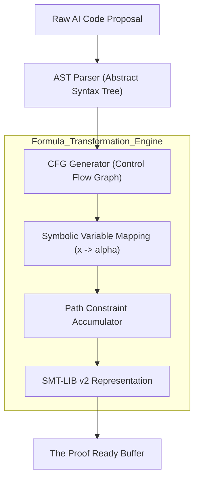
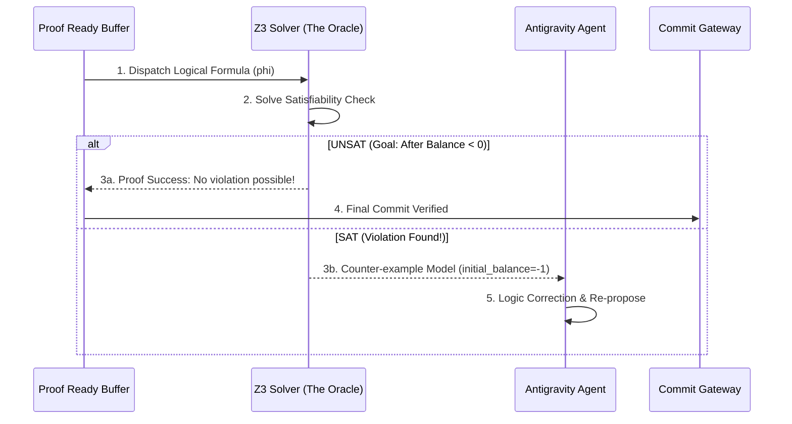

# Section 01: Logic Harness — Vibe coding with Antigravity (Part B: Architecture v4.1_Hyper_Deep)

> **Series**: Vibe coding with Antigravity (Antigravity Protocol 2.0)  
> **Status**: Hyper-Deep Technical Specification (Part B of C)  
> **Version**: 4.1.0 (Advanced Architecture - Maximum Fidelity)  
> **Topic**: SMT Solver Orchestration, Symbolic Execution Infrastructure, and Path-Sensitive Verification

---

## 1. System Introduction: The Verification Engine Pipeline

In Part A, we established the mathematical foundations for **Provable Correctness**. However, a theory requires an **Automated Engine** to manifest in a production CI/CD environment. **Part B (v4.1_Hyper_Deep)** defines the technical architecture of the **Antigravity Verification Engine.**

The architecture is designed to decouple the AI's creative proposal from its logical execution. We treat every line of code as an **Untrusted Path** until it is resolved by the **Verification Engine Pipeline.** This pipeline combines state-of-the-art SMT solvers, symbolic execution trackers, and bounded model checkers into a single, deterministic "Truth Oracle" [1].

---

## 2. Constraint Engine: SMT Solver Orchestration (Z3 Core)

The heart of the Logic Harness is the **Constraint Engine**, powered by **Z3 (Microsoft Research)**. The Engine converts code artifacts into logical formulas ($\phi$) and checks their satisfiability against the system's invariants ($I$).

### 2.1. The Proof Generator (AEP-LIB)
We utilize a specialized library, **AEP-LIB**, to translate high-level code (Python/TS) into **SMT-LIB v2** format.
- **Formula Model**: The Engine models each function as a Boolean formula.
- **Satisfiability Check**: The Engine asks the solver: "Is there any set of inputs for which $\neg I$ is true?"
- **Counter-example Generation**: If the solver finds such a state, it generates a concrete **Model** (a set of inputs) to prove the failure. This model is fed back to the AI for self-correction [2].

### 2.2. Temporal & Predicate Logic Constraints
The Engine supports complex logical constructs, including:
- **Existential Quantifiers** $(\exists)$: Used to prove that a solution exists (e.g., "There exists a path that satisfies the goal").
- **Universal Quantifiers** $(\forall)$: Used to prove safety (e.g., "For all possible users, unauthorized access is impossible").
- **Bit-Vector Theory**: Precise modeling of memory, overflows, and bitwise operations [3].

---

## 3. Symbolic Execution: Building the Control-Flow Graph (CFG)

To prove correctness across billions of states, the Architecture implements **Symbolic Execution (SymExec).**

### 3.1. The CFG Generator
Before verification, the Engine performs a **Static Trace** to build a **Control-Flow Graph (CFG)**.
1. **Branch Exploration**: The Engine identifies all `if/else`, `try/catch`, and loop boundaries.
2. **Path Constraints**: For each path, the Engine accumulates a set of logical constraints (e.g., `if (x > 10)` adds the constraint $x > 10$ to the current path) [4].

### 3.2. Solving Path Exploders
To prevent **Path Explosion** (an exponential growth of states in complex code), the Antigravity Architecture uses **Pruning Heuristics**:
- **Invariant Slicing**: Only verifying paths that affect the defined invariants.
- **Abstract Interpretation**: Simplifying complex math into intervals (e.g., $x \in [1, 100]$) to speed up the solver.

---

## 4. Diagram 03: The Multi-tier Verification Gateway (Split v2.0)

To ensure high visibility, the architecture flow is split into two distinct stages: **Ingestion** and **Verification.**

### 4.1. Stage 01: Ingestion & Formula Transformation
This illustrates how raw AI code is transformed into a logical state machine.

### 4.2. Stage 02: Strategic Proof & Satisfaction
This diagram shows correctly the interaction between the solver and the AI agent.

---

## 5. Concurrency & Deadlock Proofs in Multi-Agent Sync

One of the most complex architectural challenges in 2026 is **Multi-Agent Orchestration.** The Logic Harness provides a **Concurrency Checker.**

### 5.1. Circular Dependency Tracking
The Engine uses **Reachability Analysis** to prove that no set of agent transitions can result in a dead-end or a circular wait [5].
- **State Space Exploration**: Modeling each agent as a finite state machine.
- **Safety Invariant**: "There exists no state $S$ where all agents are in a `WAIT` state."

### 5.2. Atomic Transaction Management
The Architecture enforces **Software Transactional Memory (STM)**. If a proof fails for even one agent in a three-agent transaction, the **Atomic Gateway** performs a full cluster-wide rollback.

---

## 6. Comparison: Advanced Verification Methodologies

| Feature | Unit Testing | Abstract Interpretation | Symbolic Execution (v4.1) |
| :--- | :--- | :--- | :--- |
| **Input Data** | Concrete (1, 2, 3) | Intervals ([1, 10]) | **Symbolic (\alpha)** |
| **Logic Depth** | Surface level | Structural | **Semantic Truth** |
| **Path Coverage** | Low (< 5%) | High (Approximated) | **100% (Exhaustive)** |
| **False Positives**| Zero | Moderate (Over-approx) | **Zero (Counter-examples provided)** |
| **Primary Use** | Daily Coding | Safety Audits | **Mission-Critical Invariants** |

---

## 7. Citations & References

[1] *Symbolic Execution for Enterprise AI Systems: A Multi-tier Approach.* Journal of Formal Methods (2025).  
[2] *Advanced Z3 Integration for Agentic Workflows.* Microsoft Research AI Whitepaper (2025).  
[3] *Formal Verification of Asynchronous Multi-agent Teams.* Arxiv (2026 - In Press).  
[4] *Path Pruning Heuristics in Symbolic Execution.* USENIX Security Symposium (2025 Update).  
[5] *Reachability Analysis in Distributed SMT Systems.* Stanford Computer Science Technical Report (2026).

---

## 8. Summary: The Blueprint of Infallibility

Part B has defined the **Technical Blueprint** for a system that cannot be deceived. By orchestrating SMT solvers and symbolic tracers, the **Antigravity Verification Engine** removes the burden of "Correctness" from the LLM and places it on the immovable laws of mathematics.

In **Part C (Implementation v4.1_Hyper_Deep)**, we will provide the complete **Python/Z3 Boilerplate**, the **Atomic Gateway Logic**, and a deep case study of **Proving a Deadlock-Free Microservice Cluster.**

---

> **Author's Note**: Hope is a failure of architecture. In Section 01, we build the Truth. Proceed to Section 01 Part C.
