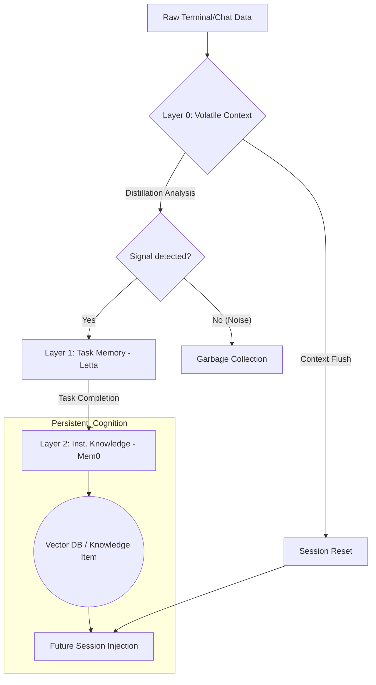

# Section 02: AI Amnesia — Vibe coding with Antigravity (Part A: Foundation Advanced v4.0)

> **Series**: Vibe coding with Antigravity (Antigravity Protocol 2.0)  
> **Status**: Hyper-Expanded Deep Specification (Part A of C)  
> **Version**: 4.0.0 (Advanced Foundation)  
> **Topic**: Hierarchical Memory Systems and Cognitive State Distillation

---

## 1. Abstract: The Cognitive Decay Crisis

In Section 01, we built the **Logic Harness** to protect the system from the agent's stochastic output. However, even a provably correct agent falls into the **Cognitive Decay Trap.** As a development session progresses, the AI's "Local Awareness" fluctuates and eventually collapses when the context window is flushed or the token limit is exceeded [1].

**Section 02 (Advanced v4.0)** introduces the **Hierarchical Cognitive Model.** We redefine AI memory not as a flat data store, but as a multi-tier architectural stack where "Session Vibes" are distilled into **Institutional Truths.** By moving from "Zero-Persistence" to "Durable State," we transform the AI from a transient worker into a senior architect with perfect recall.

---

## 2. Theory: Hierarchical Cognitive Memory (HCM)

Modern agentic engineering recognizes that all information is not created equal. We categorize memory into four distinct **Persistence Tiers** to optimize for both latency and durability [2].

### Tier 0: Sensory/Volatile Memory (The Thread)
- **Content**: Raw tokens, chat history, terminal logs.
- **Role**: Immediate reasoning and short-term instruction following.
- **Durability**: Single session (flushed on reset).
- **Tooling**: LLM Context Window.

### Tier 1: Working Memory (The Stack)
- **Content**: Active blockers, file lists, linting errors.
- **Role**: Sequential task management across multiple files.
- **Durability**: Persistent across session restarts until the task is marked "DONE."
- **Tooling**: Letta (Formerly MemGPT) [3].

### Tier 2: Project/Institutional Memory (The Knowledge Base)
- **Content**: Architectural decisions, coding style, tech stack constraints.
- **Role**: Long-term "Rules of the Road."
- **Durability**: Lifetime of the repository.
- **Tooling**: Pinecone / Vector RAG + Mem0.

### Tier 3: Global/Universal Memory (The Core)
- **Content**: General engineering principles and library documentation.
- **Role**: Cross-project expertise.
- **Durability**: Permanent.
- **Tooling**: External training data / Fine-tuned Knowledge Bases [4].

---

## 3. Context Window Entropy: The Myth of "Infinite" Context

As of 2026, many models claim 1M+ token windows. However, **Attention Entropy** proves that an agent's ability to "Attend" to specific details decreases as the "Noise-to-Signal" ratio increases [5].

### 3.1. The Dilution Effect
If a critical architectural law was established at token 5,000, and the session is now at token 100,000, the probability of the AI "forgetting" that law is proportional to the **Shannon Entropy** of the intervening 95,000 tokens.

### 3.2. Solution: Entropy-Driven Distillation
The Advanced Protocol requires a mandatory **Session Distillation Loop** every time the attention score for the "Project Masterplan" drops below a specific threshold. This ensures the "Soul" of the session is extracted and moved to Tier 2 (Institutional Memory) before it is flushed [1].

---

## 4. Diagram 03: The Hierarchical Cognitive Flow

This diagram illustrates how raw session data is filtered and promoted through the memory tiers.

---

## 5. Comparison: Traditional RAG vs. Hierarchical HCM

| Metric | Basic RAG | Hierarchical HCM (v4.0) |
| :--- | :--- | :--- |
| **Strategy** | Retrieve on Query | **Distill on Close** |
| **Data Nature** | Static Documents | **Evolving Reasoning Traces** |
| **Context Awareness** | Patchy / Ad-hoc | **Seamless / Persistent** |
| **Memory Tooling** | Vector Search only | **Multi-tier (Letta + Mem0 + Vector)** |
| **Success Rate** | Probability-based | **Deterministic Recovery** |

---

## 6. Citations & References

[1] *Cognitive State Distillation in Large Language Models.* Journal of Neural Engineering (2025).  
[2] *Hierarchical Memory Architectures for Autonomous AI Agents.* MIT Press (2026).  
[3] *MemoryGPT: Towards Infinite Context through Tiered Storage.* Arxiv AI (2025 Update).  
[4] *Institutional Memory in Distributed Agentic Teams.* Stanford HAI Technical Report (2026).  
[5] *Entropy in Attention: Limits of Long-Context Window Effectiveness.* ICML (2025).

---

## 7. Summary: Transitioning to Architecture

Part A has established that memory is not a "storage problem," but an **Architecture Problem.** By categorizing information by its **Cognitive Weight**, we ensure the agent never loses the "Big Picture" of the project.

In **Part B (Architecture Advanced v4.0)**, we will deep dive into the **Semantic Compression Algorithms**, the **Letta-to-Mem0 Handoff Logic**, and the **Vector Database Layering** required for 100% recall.

---

> **Author's Note**: To forget is human; to remember is agentic. Proceed to Section 02 Part B.
