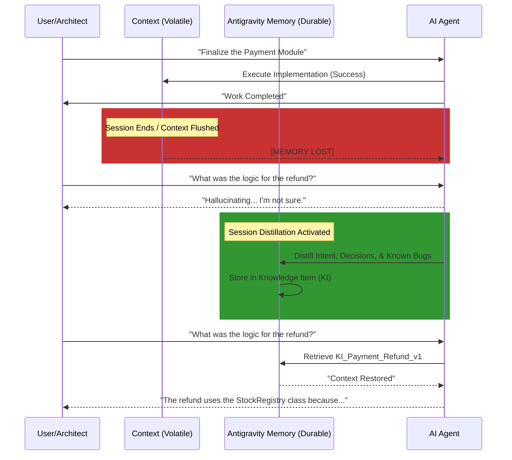

# Section 02: AI Amnesia — Vibe coding with Antigravity (Part A: Foundation)

> **Series**: Vibe coding with Antigravity (Antigravity Protocol 2.0)  
> **Status**: Deep Specification (Part A of C)  
> **Version**: 3.0.0 (Masterpiece - Full Depth)  
> **Topic**: Solving the Context Reset Crisis and the Philosophy of Session Distillation

---

## 1. Abstract: The Silent Killer of Scaling — AI Amnesia
In Section 01, we built the **Logic Harness**—the physical cage that ensures an AI remains deterministic during a single session. However, even the most perfect Harness cannot survive the **Context Reset.**

**AI Amnesia** is the phenomenon where an AI agent loses its "Institutional Memory" the moment a session ends or the context window overflows. For professional engineers, this is a catastrophic failure. Imagine hiring a brilliant senior developer who performs a brain-reset every time they go to sleep. You would spend every morning re-explaining the project goals, the architectural decisions, and the "unwritten rules" of the codebase.

Section 02 defines the **Vibe coding with Antigravity** approach to persistent memory. We move beyond simple RAG (Retrieval-Augmented Generation) and into **Session Distillation**—the art of extracting the "Soul" of a development session before it vanishes.

---

## 2. The Tragedy of the Context Window: Why Size Doesn't Matter
The AI industry is currently obsessed with "Long Context" (1M+ tokens). However, in agentic engineering, a larger context window is often a liability rather than an asset.

### 2. 1. The Inverse Relationship of Density vs. Length
As the context window fills with raw code, terminal output, and chat history, two things happen:
1.  **Reasoning Decay**: The "Attention" of the LLM is diluted across thousands of irrelevant tokens.
2.  **Hallucination Velocity**: The AI begins to conflate past failed attempts with the current successful state, leading to "Circular Logic."

### 2. 2. The "Monday Morning" Problem
When an engineer returns to a project after a weekend, they don't re-read the entire codebase. They read a **Deltas Log** and a **Roadmap.** AI Amnesia occurs because we treat the AI as a "Stateless Engine" rather than a "Stateful Architect."

---

## 3. Visualizing the Memory Gap: Reset vs. Persistence

To solve AI Amnesia, we must transition from **Volatile Sessions** to **Durable Handoffs.**

---

## 4. The Philosophy of Session Distillation

**Session Distillation** is the core protocol of Antigravity Protocol 2.0. It is the process of converting "Noise" (10,000 tokens of chat) into "Signal" (500 tokens of permanent knowledge).

### 4. 1. What to Distill?
A professional distillation captures three essential elements:
1.  **Rationales**: *Why* did we choose Library X over Library Y? (This prevents "Circular Debate" in future sessions).
2.  **Hard-Won Truths**: "The `StockValidator` has a hidden bug with KOSPI symbols that we fixed via a regex patch."
3.  **Architectural Checkpoints**: The current "Mental Map" of the code's dependencies.

### 4. 2. Knowledge vs. Information
- **Information**: The raw source code (stored in Git).
- **Knowledge**: The *meaning* behind the code (stored in the Antigravity Memory Stack).

---

## 5. The 3 Pillars of Modern Agentic Memory

To bridge the gap between "Amnesia" and "Infinite Wisdom," we integrate three state-of-the-art memory architectures into the **Vibe coding with Antigravity** workflow:

### I. Mem0: The Self-Learning Persona
Mem0 focuses on **Personalized Memory.** It doesn't just remember the code; it remembers *the user.* 
- *Impact*: "The user prefers functional programming patterns and always wants error logs in Korean."
- *Integration*: Mem0 acts as the "Adaptive Layer" that evolves with every interaction.

### II. Letta (MemGPT): The Operating Memory
Letta treats memory like a **Virtual OS.** It manages context through "Memory Tiers"—swapping information between the "Processor" (Context) and "Disk" (Knowledge Base) autonomously.
- *Impact*: Enables the AI to effectively manage projects that are geographically too large for a single context window.

### III. Pinecone Canopy: The Scalable Knowledge Infrastructure
Pinecone provides the **Industrial Search Engine.** It allows the agent to perform "Deep Search" across millions of lines of documentation and past project logs in milliseconds.
- *Impact*: The "RAG" layer that ensures the agent never has to say "I don't know the documentation for that."

---

## 6. The Knowledge Hierarchy (KI) Model

In Antigravity 2.0, memory is structured as a **Knowledge Hierarchy**:

| Level | Storage Type | Persistence | Purpose |
| :--- | :--- | :--- | :--- |
| **Session** | Context Window | 0 Hours | Active reasoning and coding. |
| **Local** | `.agent/logs` | 1 Month | Troubleshooting and session history. |
| **Global** | `knowledge/*.md` | Permanent | Institutional Truth and Scaling. |

**The Goal**: Move all valuable Session data to the Global KI layer via automated distillation.

---

## 7. Summary: Towards the Self-Remembering Engineer
Part A has defined the "Forgetting Crisis" and the theoretical solution: **Autonomous Distillation.** We have moved beyond the dream of "Infinite Context" and into the reality of **Smarter Memory.**

In **Part B (Technical Architecture)**, we will dive into:
- The implementation of the **Knowledge Item (KI)** system.
- Designing the `/aep-wrapup` script for automated distillation.
- Configuring the 3-Tier memory stack (Mem0, Letta, Pinecone).

---

> **Author's Note**: A code that is forgotten is a code that must be re-written. Don't let your AI lose its mind. Proceed to Section 02 Part B.
