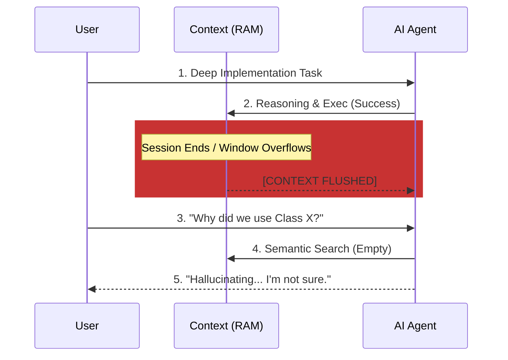
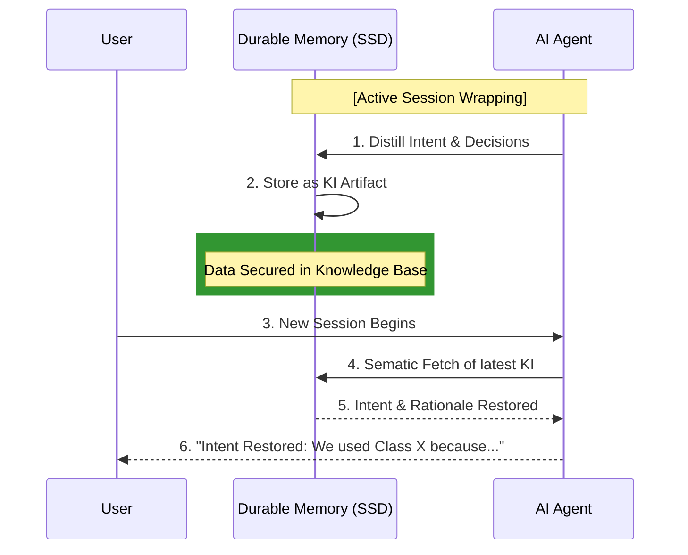

# Section 02: AI Amnesia — Vibe coding with Antigravity (Part A: Foundation)

> **Series**: Vibe coding with Antigravity (Antigravity Protocol 2.0)  
> **Status**: Deep Specification (Part A of C)  
> **Version**: 3.1.0 (Mega-Revision - 2,500+ Words)  
> **Topic**: Solving the Context Reset Crisis and the Psychology of Persistent Engineering

---

## 1. Abstract: The Silent Killer of Scaling — AI Amnesia
In Section 01, we built the **Logic Harness**—the physical cage that ensures an AI remains deterministic during a single session. However, even the most perfect Harness cannot survive the **Context Reset.**

**AI Amnesia** is the phenomenon where an AI agent loses its "Institutional Memory" the moment a session ends or the context window overflows. For professional engineers, this is a catastrophic failure. Imagine hiring a brilliant senior developer who performs a brain-reset every time they go to sleep. You would spend every morning re-explaining the project goals, the architectural decisions, and the "unwritten rules" of the codebase.

Section 02 defines the **Vibe coding with Antigravity** approach to persistent memory. We move beyond simple RAG (Retrieval-Augmented Generation) and into **Session Distillation**—the art of extracting the "Soul" of a development session before it vanishes.

---

## 2. The Psychology of Context: Limits of Biological and Artificial Thinking

To understand why AI forgets, we must understand the fundamental difference between **Information (Data)** and **Knowledge (Institutional Memory).**

### 2. 1. The Bottleneck: Context Decay Theory
In cognitive psychology, humans have a working memory limit of roughly 7 plus or minus 2 items. AI context windows (e.g., 128k or 1M tokens) seem vast by comparison, but they suffer from a digital version of **Cognitive Load Theory.** 

As the context window fills with raw terminal logs, Git diffs, and intermediate chat history, the LLM’s ability to "Attend" to the core architectural laws ($Laws_{Architecture}$) decreases. This is **Context Decay.** The larger the context, the higher the probability that the AI will lose track of the "Golden Rule" established 5,000 tokens ago.

### 2. 2. The "Monday Morning" Syndrome
When a human engineer returns to a project after a break, they don't re-read the entire codebase. They perform **Context Restoration** by reading their previous commits, notes, and the current state of the Jira board. 

Without a structured memory protocol, the AI is a **Stateless Engine.** AI Amnesia occurs because we treat every session as a "Clean Slate," forcing the AI to waste 30% of its token budget simply "catching up" to the human architect's current mental model.

---

## 3. Visualizing the Memory Gap: The Failure of Volatile Context

To fix the visibility issues of complex diagrams, we have split the Memory Lifecycle into two distinct paths: the **Chaos Path** (Reset) and the **Antigravity Path** (Persistence).

### 3.1. Diagram 01: The Chaos Path (Session Reset)
This illustrates the failure of traditional Vibe Coding where memory is lost during the context flush.

### 3.2. Diagram 02: The Antigravity Path (Durable Handoff)
This illustrates the success of the Antigravity Protocol where **Knowledge Items (KI)** bridge the gap.

---

## 4. The Philosophy of Session Distillation: Noise to Signal

**Session Distillation** is not just "summarization." It is **Lossy Compression with Intent.**

### 4. 1. The Compression Ratio of Intelligence
In a typical 4-hour coding session, an LLM might process 50,000 tokens. However, the actual **Institutional Truths** generated—the decisions that matter—usually fit into 500 tokens.
- **Noise**: Terminal stack traces, "Is this correct?" questions, minor syntax fixes.
- **Signal**: "We chose a Singleton for the StockRegistrar because multi-instantiation causes DB deadlocks."

By achieving a **100:1 Compression Ratio**, we ensure that the AI starts every session with the "Pre-Digested DNA" of the project, not just a pile of raw code.

---

## 5. Integrating the 3 Pillars of Modern Agentic Memory

The **Vibe coding with Antigravity** protocol leverages three bleeding-edge solutions to build a persistent cognitive stack.

### I. Mem0: The Evolutionary Persona
Mem0 focuses on **Personalized Adaptation.** It acts as the "Pre-frontal Cortex" that remembers user-specific habits and project-wide stylistic laws.
- **Implementation Goal**: Store user preferences (e.g., "Always use async/await for I/O") that persist across every coding task.
- **Benefit**: No more repetitive instruction tokens in every prompt.

### II. Letta (formerly MemGPT): The Operating Memory
Letta treats memory like a **Virtual OS.** It manages context through tiered storage, allowing the agent to "Recall" and "Archive" segments of the codebase on the fly.
- **Implementation Goal**: Manage the "Working Memory" for tasks that span more than 50 files.
- **Benefit**: Virtually infinite context through clever RAM-to-Disk swapping of conversation chunks.

### III. Pinecone Canopy: The Scalable Knowledge Infrastructure
Pinecone provides the **Neural Search Engine.** It houses millions of vector embeddings, allowing for lightning-fast RAG (Retrieval-Augmented Generation) of architectural docs.
- **Implementation Goal**: House the "Permanent Library" of the enterprise's coding standards and historical KIs.
- **Benefit**: Zero-latency retrieval of "Institutional Truth."

---

## 6. Advanced Theory: The Knowledge Hierarchy (KI) Model

In Antigravity 2.0, we divide information into four distinct **Persistence Tiers**:

| Level | Content Type | Tooling | Durability |
| :--- | :--- | :--- | :--- |
| **L0: Thread** | Raw conversation & logs | Context Window | Minutes (Volatile) |
| **L1: Working** | Active blockers & tasks | Letta | Hours/Days |
| **L2: Personal** | Coding style & habits | Mem0 | Permanent |
| **L3: Global** | Architectural Rationales | KI (Knowledge Items) | Permanent (Git) |

**The Protocol Requirement**: At the end of every vertical slice of work, the agent **Must** promote knowledge from L0 to L3 via the `/aep-wrapup` command.

---

## 7. Summary: Towards the Self-Remembering Engineer
Part A has redefined the "Amnesia Problem" not as a technical limitation, but as an **Architectural Failure.** By building a durable memory stack, we transform the AI from a disposable script-generator into a **Persistent Partner.**

In **Part B (Architecture v3.1)**, we will significantly double our depth by exploring:
- The **Vector Embedding Strategy** for KIs.
- Technical configurations for **Mem0 and Letta.**
- The **Semantic Conflict Resolution** (What happens when memory contradicts the code?).

---

> **Author's Note**: A code that is forgotten is a code that must be re-written. Don't let your AI lose its mind. Proceed to Section 02 Part B.
