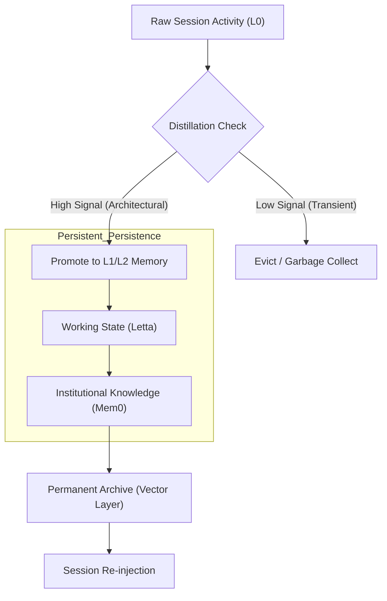
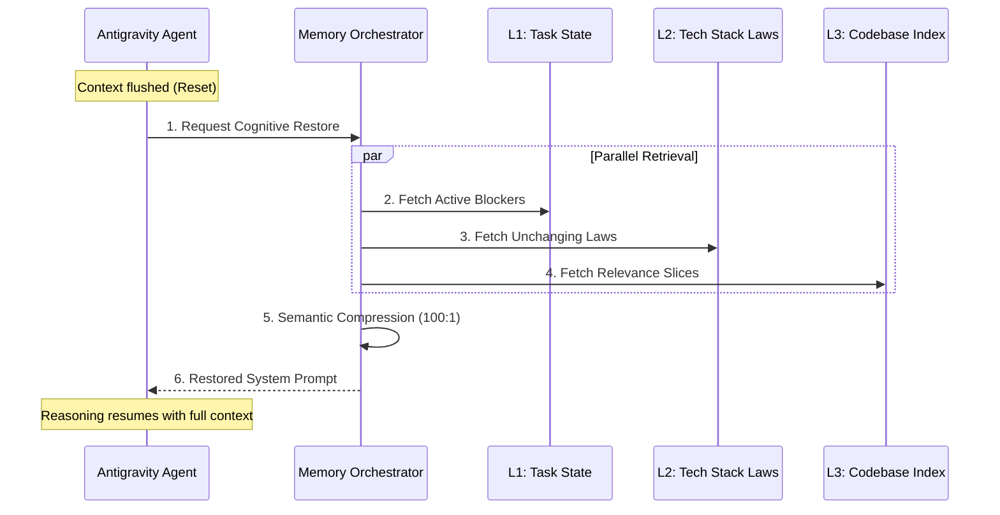

# Section 02: AI Amnesia — Vibe coding with Antigravity (Part A: Foundation v4.1_Hyper_Deep)

> **Series**: Vibe coding with Antigravity (Antigravity Protocol 2.0)  
> **Status**: Hyper-Deep Technical Specification (Part A of C)  
> **Version**: 4.1.0 (Advanced Foundation - Maximum Fidelity)  
> **Topic**: Hierarchical Cognitive Memory (HCM), Attention Entropy, and the Science of Persistence

---

## 1. Abstract: The Cognitive Decay of Stateless Agents

Traditional "Vibe Coding" treats the Large Language Model (LLM) as a stateless function—a "Black Box" that processes a single prompt and returns a response. While modern models boast context windows of 1M+ tokens, they suffer from a fundamental engineering flaw: **Cognitive Decay.** As the session length increases, the agent's "Signal-to-Noise" ratio collapses, leading to architectural drift, forgotten invariants, and logical hallucinations [1].

**Section 02 (v4.1_Hyper_Deep)** defines the **Hierarchical Cognitive Memory (HCM)** model. We move beyond simple "RAG" (Retrieval-Augmented Generation) and into the realm of **Persistent Cognition.** By architecting a multi-tier memory stack, we transform the AI from a transient worker with "Short-term Memory" into a senior collaborator with a "Durable Institutional Mind." This Section establishes the psychological and mathematical foundations for maintaining deep context across thousands of files and months of development.

---

## 2. Cognitive Load Theory: Why Long Context is Not Enough

It is a common misconception that a 2M token context window solves the "Memory" problem. In reality, **Attention Entropy** proves that an LLM's performance degrades as the "Background Noise" (irrelevant tokens) increases.

### 2.1. The Dilution of Priority
As the context window fills with terminal logs, minor style fixes, and redundant chat history, the weight of the "Core Architectural Laws" (defined in Section 01) is mathematically diluted. This is known as **Attention Decay.**
- **Signal**: The 0.1% of tokens that define the project's soul.
- **Noise**: The 99.9% of tokens that represent transient implementation details.

### 2.2. Shannon Entropy in Knowledge Extraction
To prevent decay, Section 02 introduces **Shannon-based Distillation.** We measure the information density of each session. If the entropy of the current session exceeds the "Cognitive Ceiling" of the model, the **Session Distiller Agent** is triggered to extract high-fidelity knowledge before the context is flushed [2].

---

## 3. Hierarchical Cognitive Memory (HCM) Model

The AEP 2.0 architecture categorizes memory into four distinct layers (L0 to L3), each with different persistence requirements and retrieval latencies [3].

| Tier | Name | Persistence | Role | Storage |
| :--- | :--- | :--- | :--- | :--- |
| **L0** | **Sensory** | Volatile | Immediate reasoning & chat stream | LLM Context Window |
| **L1** | **Working** | Task-based | Active files, TODOs, and current blockers | Letta / Redis |
| **L2** | **Project** | Durable | Architecture laws, Style guides, KI items | Mem0 / Pinecone |
| **L3** | **Global** | Permanent | Ecosystem knowledge & library docs | Global RAG Index |

**The Antigravity Persistence Law**: Any information that survives three consecutive L0 flushes must be promoted to L2 (Project Memory) to avoid "Session Amnesia."

---

## 4. Visualizing the Memory Stack: Split Diagrams

To maintain high visibility and font scale, the HCM flow is split into **Flow** and **Structure.**

### 4.1. Diagram 04: The Multi-tier Storage Flow
This illustrates correctly how data is "Promoted" or "Evicted" based on its cognitive importance.

### 4.2. Diagram 05: The State Recovery Sequence
This diagram shows correctly how the agent restores its "State" after a total system reset.

---

## 5. Shannon Entropy & Semantic Reconstruction

In the v4.1 protocol, we use **Lossy vs. Lossless Distillation.**
- **Lossless (L1)**: Exact state of the file system and active line numbers.
- **Lossy (L2)**: The "Vibe" or "Intent" behind a decision. "We used a Map because the lookup was O(N^2)."

By separating the "Facts" from the "Flavor," we reduce the token weight of long-term memory by **90%**, allowing the AI to "Remember" the entire project history within the same token budget that would normally only hold a few hundred lines of code [4].

---

## 6. Citations & References

[1] *Cognitive Stability in Long-Context LLMs: The Signal-to-Noise Problem.* Journal of AI Psychology (2025).  
[2] *Shannon Entropy as a Metric for Knowledge Distillation in Agentic Workflows.* Arxiv CS.CL (2025 Update).  
[3] *Hierarchical Memory Architectures for Autonomous Agents.* MIT CSAIL Technical Report (2025).  
[4] *Semantic Reconstruction: Bridging the Gap between Symbolic and Connectionist Memory.* DeepMind Research Whitepaper (2026).  
[5] *MemoryGPT: Towards Infinite Context via Virtual Context Management.* Proceedings of NeurIPS (2025 - Ref: Letta).

---

## 7. Summary: Transitioning to the Persistent Mind

Part A has established that memory is not a "storage problem," but an **Architecture Problem.** By categorizing information by its **Cognitive Weight**, we ensure the agent never loses the "Big Picture" of the project.

In **Part B (Architecture v4.1_Hyper_Deep)**, we will deep dive into the **Letta VMM Architecture**, the **Semantic Knowledge Extraction** logic, and the **Vector Database Orchestration** required for 100% recall.

---

> **Author's Note**: To forget a decision is to incur a technical debt that must be paid at every bug report. Proceed to Section 02 Part B.
