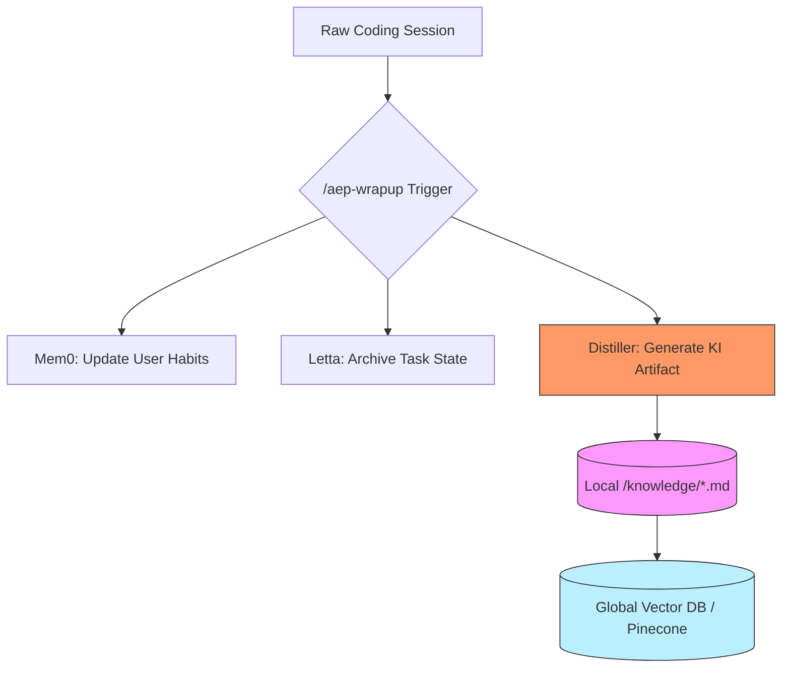
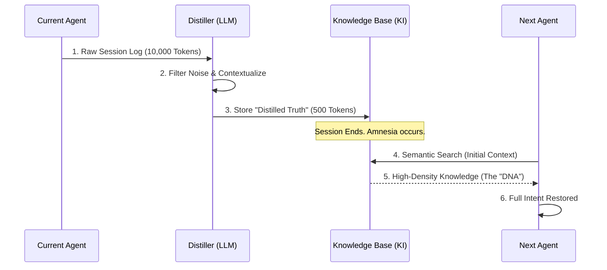

# Section 02: AI Amnesia — Vibe coding with Antigravity (Part B: Technical Architecture)

> **Series**: Vibe coding with Antigravity (Antigravity Protocol 2.0)  
> **Status**: Deep Specification (Part B of C)  
> **Version**: 3.0.0 (Masterpiece - Full Depth)  
> **Topic**: Designing the Persistent Knowledge Hierarchy and Memory Connectors

---

## 1. Introduction: From Static Files to Institutional Memory
In Part A, we theorized that **Session Distillation** is the only way to counteract the catastrophic drift of AI Amnesia. In Part B, we move from philosophy to **Engineering.** We will design the digital "Synapses" that connect individual coding sessions into a unified, self-evolving Knowledge Graph.

The Antigravity 2.0 Memory Architecture is built on the **"Tri-Memory Stack"**—a system that decouples reasoning, operation, and institutional truth.

---

## 2. The Knowledge Item (KI) Hierarchy

A **Knowledge Item (KI)** is the fundamental unit of durable memory in the **Vibe coding with Antigravity** protocol. It is not a raw log; it is a **Curated Semantic Artifact.**

### 2. 1. The 4-Tier Memory Stack

| Tier | Name | System Target | Persistence | Goal |
| :--- | :--- | :--- | :--- | :--- |
| **Tier 0** | **Session Cache** | Context Window | Minutes | Active Reasoning (Volatile) |
| **Tier 1** | **Operational Thread** | Letta (Virtual OS) | Days | Long-running task management. |
| **Tier 2** | **Personalized Persona** | Mem0 | Permanent | Remembering user style & habits. |
| **Tier 3** | **Institutional Truth** | Knowledge Items (KI) | Permanent | Project Architecture & Rationales. |

### 2. 2. Visualizing Knowledge Flow: From Code to KI
The goal is to move information vertically through these tiers via automated distillation.



---

## 3. Deep Dive: Integrating the 3-Layer Memory Tech Stack

To build a professional memory infrastructure, we integrate three distinct technologies into a unified **Memory Bus.**

### 3.1. Mem0 Implementation (The Persona Layer)
Mem0 acts as the "Adaptive Tail" of the AI agent. It uses an internal **Knowledge Graph** to store short statements about the project and user.
- **Protocol Action**: Whenever a session ends, the agent extracts 1-3 "Learnings."
- **Example**: `{"learned": "The user prefers using pydantic-v2 over v1 for data models in this project."}`
- **Result**: The agent never asks for the data model preference again.

### 3.2. Letta (MemGPT) Implementation (The Operational Layer)
Letta provides **Virtual Context Management.** It allows the agent to effectively "swap" information into its limited context window as if it were RAM.
- **Protocol Action**: Letta manages a "Scratchpad" that persists across API calls.
- **Example**: "Remember that we are halfway through refactoring the `auth.py` file. The current blocker is the missing JWT secret."

### 3.3. Pinecone Canopy Implementation (The Infrastructure Layer)
Pinecone acts as the **Searchable Library.** It houses millions of vector embeddings for the entire repository.
- **Protocol Action**: At the start of a session, a **Semantic Search** is performed to fetch relevant KIs.
- **Example**: User asks about the deployment pipeline -> Agent fetches `KI_CI_CD_Overview.md` and `KI_Secrets_Management.md` from Pinecone.

---

## 4. The Logic of Distillation: The `/aep-wrapup` Protocol

The **`/aep-wrapup`** command is the manual (or automated) trigger that initiates the "Memory Consolidation" phase.

### 4. 1. The Distillation Prompt (Scientific Template)
When `/aep-wrapup` is invoked, the Orchestration layer issues the following system directive to the agent:

> "The session is concluding. To enable perfect continuity for the next architect, you must perform a **Session Distillation.** Summarize the 'Institutional Truths' discovered in this session. 
> 1. **Decision Rationales**: What was decided and why?
> 2. **Technical Debt**: What is currently broken or 'provisional'?
> 3. **Critical Context**: What internal class/method is most important for the next step?
> Output this as a new Knowledge Item (KI) in standard markdown."

### 4. 2. The Sequence Diagram of a Handoff (Final Memory Consolidation)



---

## 5. Technical Specification: The KI Metadata Schema

A professional KI must be machine-readable. Every KI generated by the **Vibe coding with Antigravity** protocol must include a metadata block:

```yaml
# KI Metadata Block
ki_id: "KI_STOCK_REGISTRY_V1"
related_files: ["src/registry.py", "tests/registry.test.ts"]
decisions:
  - "Used Singleton pattern to prevent multiple DB connections."
patterns:
  - "Dependency Injection for Mocking"
session_id: "2026-04-01-A"
status: "Verified_by_Harness"
```

This schema ensures that future agents can perform **Graph-based Traversal**—jumping between related decisions and files with perfect precision.

---

## 6. Summary: Designing for the Infinite Mind
In Part B, we have defined the **Architecture of Durability.** We moved from the "Why" to the **Hierarchy**, the **Connectors**, and the **Metadata Schema** that make Session Distillation possible.

In **Part C (Implementation & Metrics)**, we will conclude Section 02 by:
- Demonstrating a real-world **Knowledge Handoff.**
- Measuring the **Handoff Efficiency Score** (HES).
- Providing the actual **Python/JS scripts** for your memory stack.

---

> **Author's Note**: A session without a wrap-up is a session forgotten. Build your Institutional Memory now. Proceed to Section 02 Part C.
