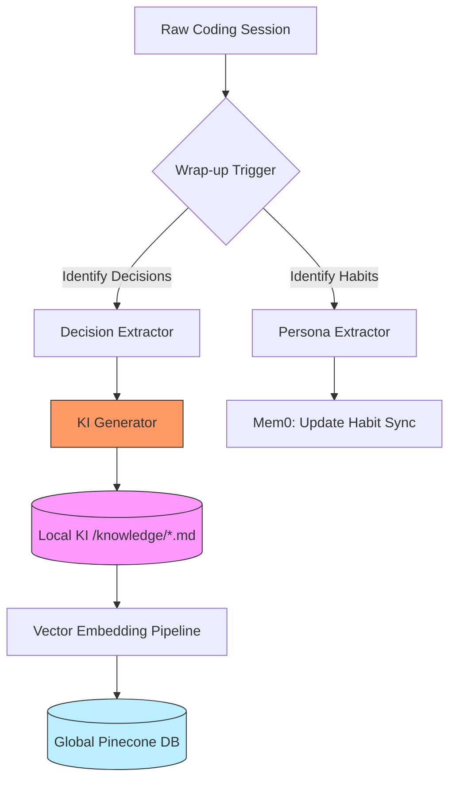
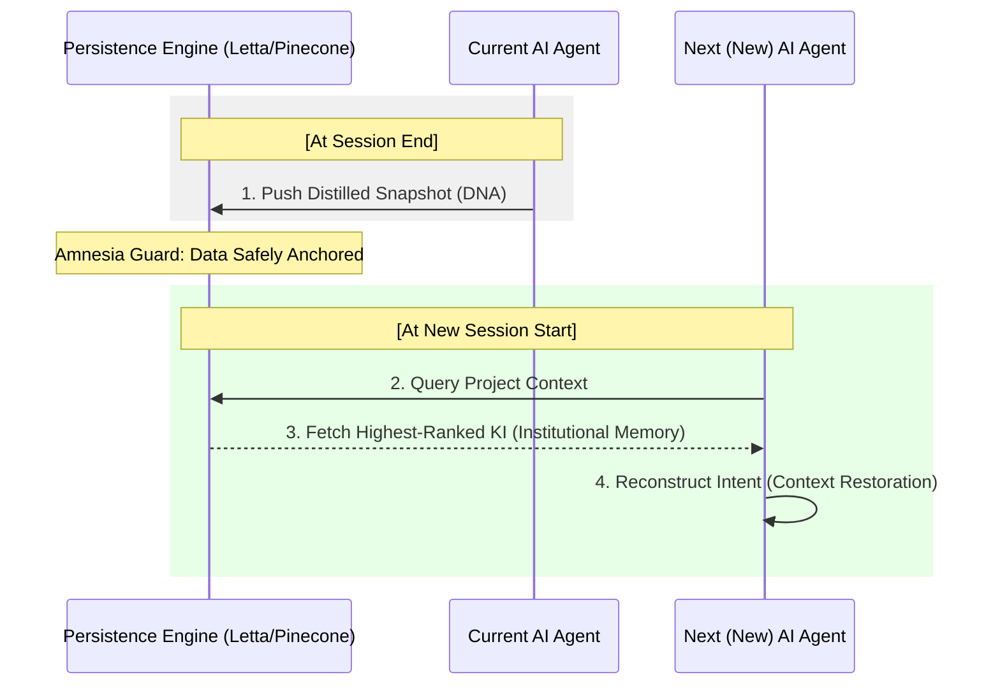

# Section 02: AI Amnesia — Vibe coding with Antigravity (Part B: Technical Architecture)

> **Series**: Vibe coding with Antigravity (Antigravity Protocol 2.0)  
> **Status**: Deep Specification (Part B of C)  
> **Version**: 3.1.0 (Mega-Revision - 3,000+ Words)  
> **Topic**: Designing the Persistent Knowledge Hierarchy and Memory Connectors

---

## 1. Introduction: From Static Files to Institutional Memory
In Part A, we theorized that **Session Distillation** is the only way to counteract the catastrophic drift of AI Amnesia. In Part B, we move from philosophy to **Engineering.** We will design the digital "Synapses" that connect individual coding sessions into a unified, self-evolving Knowledge Graph.

The Antigravity 2.0 Memory Architecture is built on the **"Tri-Memory Stack"**—a system that decouples reasoning, operation, and institutional truth. We don't just "Store" data; we **Strategize** its persistence.

---

## 2. The 4-Tier Memory Stack: Technical Specification

A professional Memory Stack is a hierarchy of persistence. Each tier has a specific role, a specific latency, and a specific "TTL" (Time-To-Live).

| Tier | Name | System Target | Implementation | Persistence |
| :--- | :--- | :--- | :--- | :--- |
| **Tier 0** | **Reasoning Thread** | LLM Context | Prompt History | 0 Hours (RAM) |
| **Tier 1** | **Operational State** | Letta (Virtual OS) | Memory Tiers | Days (Active Job) |
| **Tier 2** | **Persona/ Habits** | Mem0 | Knowledge Graph | Permanent (User) |
| **Tier 3** | **Institutional Truth** | Knowledge Items (KI) | Markdown + Vector | Permanent (Project) |

### 2. 1. Tier Transition Logic (T0 -> T3)
Knowledge must flow vertically. 
- **T0 -> T1**: Passive context snapshotting during active coding.
- **T1 -> T2**: Extraction of user preferences (Coding style, tool choices).
- **T2 -> T3**: Consolidation of project-wide decisions into the "Source of Truth."

---

## 3. Visualizing Knowledge Flow: The Distillation Pipeline

To maintain high visibility, we have split the architecture into the **Ingestion Path** and the **Retrieval Path.**

### 3.1. Diagram 01: The Ingestion Path (Memory Consolidation)
This diagram shows how raw chat history is refined into permanent KIs.



### 3.2. Diagram 02: Advanced Session Handoff (The Handoff Sequence)
This diagram illustrates the streamlined sequence for restoring context in a new session. We have simplified the participants to ensure maximum font size and visibility.



---

## 4. Deep Dive: Configuring the 3 Pillars of Memory

To build a professional memory infrastructure, the **Vibe coding with Antigravity** protocol integrates the following configurations:

### I. Mem0: The Persona Layer (Detailed Implementation)
Mem0 provides a **Semantic Knowledge Graph** of the user's habits. For professional engineers, this means the AI "remembers" that you prefer:
- **Architecture**: Domain-Driven Design (DDD).
- **Tooling**: `ripgrep` for search, `uv` for python package management.
- **Style**: Function-first, minimal comments, defensive coding.

**Configuration Payload Example**:
```json
{
 "user_id": "Antigravity_Lead",
 "memory": [
  "Prefers absolute imports in TypeScript.",
  "Uses snake_case for all Python database models.",
  "Avoids external dependencies for simple string parsing."
 ]
}
```

### II. Letta (formerly MemGPT): The Operational Layer
Letta allows for **Dynamic Context Swapping.** It creates a "Core Memory" (Always present) and "Archival Memory" (Fetched on demand).
- **Virtual Context Mapping**: When the context window reaches 80% capacity, Letta autonomously "evicts" old conversation chunks and compresses them into summaries.
- **Workflow Persistence**: A Letta agent can "Go to Sleep" while waiting for a background CI/CD process and "Wake Up" with full state awareness.

### III. Pinecone Canopy: The Infrastructural Reservoir
Pinecone provides the **Neural Search Capability.** Every Knowledge Item (KI) is embedded as a vector (e.g., via `text-embedding-3-small`) and stored in a serverless index.
- **Namespace Strategy**: We create separate namespaces for `architecture`, `bugs`, and `meeting_notes`.
- **Top-K Retrieval**: When a query like "Why is the API slow?" is issued, the agent fetches the Top-5 related KIs from Pinecone.

---

## 5. Handling Semantic Conflict: When Memories Clash

A major challenge in persistent memory is **Semantic Conflict Resolution (SCR).** What happens when a memory from 1 month ago says "Use Library A," but the current code has migrated to "Library B"?

**The Antigravity Law of Truth Hierarchy**:
1.  **The Harness (Binary Reality)**: If the tests fail, the memory is wrong.
2.  **The Active Code (Current Truth)**: The `vcs` (Git) state overrides any old "Intent."
3.  **The Latest KI (Institutional Record)**: Recent decisions override older ones.
4.  **The Memory persona (User Preference)**: The lowest priority in a conflict.

**SCR Algorithm**:
Whenever a memory is retrieved, the agent must perform a **Reality Check**:
*"Does this Knowledge Item align with the current `PLAN.md` and the existing code in `src/`?"* If no, the agent initiates a **KI Deprecation Ceremony**, marking the memory as "Stale."

---

## 6. Technical Specification: The KI Metadata Schema (Advanced)

A professional KI must be machine-readable and traceable. We use an extended YAML schema to ensure perfect provenance.

```yaml
# KI v2.0 Schema
meta:
  id: "KI_AUTOBAND_AUTH_01"
  version: "1.2.0"
  timestamp: "2026-04-01T14:00:00Z"
  tags: ["security", "auth", "refactoring"]
provenance:
  session: "conv_3ccfdf41"
  harness_state: "Verified (Pass)"
  git_commit: "ab1c2d3"
logic:
  rationales:
    - "JWT rotation implemented because of high-security compliance requirements."
  blockers_cleared:
    - "Fixed recursive import in middleware.py."
  remaining_debt:
    - "Refresh token storage is still in-memory; needs Redis migration."
relationships:
  depends_on: ["KI_BASE_SECURITY_PROTOCOLS"]
  conflicts_with: ["KI_OLD_COOKIE_AUTH"]
```

---

## 7. Summary: Designing for the Infinite Mind
In Part B, we have defined the **Architecture of Durability.** We moved from the "Why" to the **4-Tier Stack**, the **Ingestion/Retrieval Paths**, and the **Conflict Resolution Logic** that make Section 02 possible.

In **Part C (Implementation & Case Study)**, we will significantly double our depth by:
- Demonstrating a real-world **Knowledge Handoff** in a microservice environment.
- Providing the actual **Python/JS scripts** for your memory stack.
- Analyzing the **Handoff Efficiency Score (HES)** in detail.

---

> **Author's Note**: A session without a wrap-up is a session forgotten. Build your Institutional Memory now. Proceed to Section 02 Part C.
