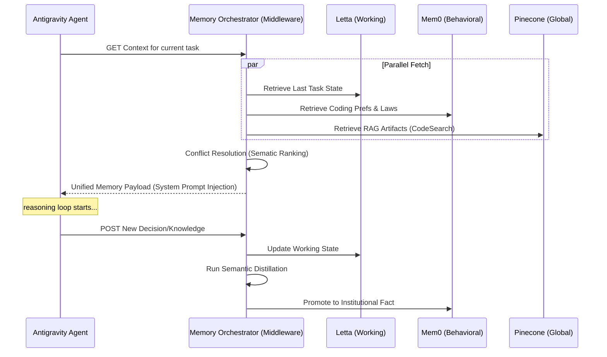

# Section 02: AI Amnesia — Vibe coding with Antigravity (Part B: Architecture Advanced v4.0)

> **Series**: Vibe coding with Antigravity (Antigravity Protocol 2.0)  
> **Status**: Hyper-Expanded Deep Specification (Part B of C)  
> **Version**: 4.0.0 (Advanced Architecture)  
> **Topic**: Hierarchical Memory Integration and Semantic Knowledge Extraction

---

## 1. Introduction: The Persistence Middleware

In Part A, we redefined AI memory as a **Hierarchical Cognitive Stack (HCS)**. Part B defines the technical architecture required to orchestrate this stack. We move from a single "Memory Bank" to a distributed middleware that manages state across multiple specialized providers (Mem0, Letta, and Pinecone) [1].

This architecture ensures that the agent's context window stays lean, focusing only on the "L0 Sensory" data while the middleware handles the "L1-L3 Persistent" memory in the background.

---

## 2. Integrated Memory Stack: The Triad

The **Antigravity Memory Orchestrator** integrates three bleeding-edge technologies into a single unified API.

### 2.1. Layer 1: Letta (The Operating Memory)
Letta acts as the **Context-to-Disk Controller.** It utilizes a Virtual File System (VFS) to swap segments of the conversation out of the prompt and into long-term storage when the window pressure increases.
- **Role**: State management of the "Current Task Graph" [2].
- **Trigger**: Automated context compression based on token budget.

### 2.2. Layer 2: Mem0 (The Experience Graph)
Mem0 provides the **Semantic Glue.** It doesn't just store logs; it extracts "Facts" about the project and the developer.
- **Algorithm**: Relationship-Aware Embedding. It maps "Why" a decision was made, not just "What" was typed [3].
- **Role**: Storing coding style, project-wide laws, and reusable engineering patterns.

### 2.3. Layer 3: Pinecone Canopy (The Institutional Library)
Pinecone acts as the **Global Neural Knowledge Base.** It houses millions of vector embeddings of the entire company's documentation and codebase.
- **Strategy**: RAG (Retrieval-Augmented Generation) at Scale.
- **Role**: Instant retrieval of architectural standards and past "Knowledge Items (KIs)."

---

## 3. Semantic Compression: From Noise to Institutional Fact

The most critical component of the architecture is the **Distillation Engine.** This engine performs **Semantic Compression** to prevent database bloat and "Memory Decay" (where irrelevant old data drowns out new facts).

### 3.1. The 100:1 Compression Ratio Logic
A typical session of 5,000 tokens is analyzed for **High-Signal Nodes.**
- **Discard**: Terminal errors (unless persistent), "Hello" messages, minor syntax fixes.
- **Retain**: Architectural pivots, new library integrations, "Mental Models" of the code structure [1].

### 3.2. Extraction Hierarchy
The Distillation Engine uses a recursive summarization approach to extract the **Project DNA**:
1. **Raw Log Summarization**: "Summary of File Change X."
2. **Intent Extraction**: "Reason for File Change X."
3. **Cross-Session Truth**: "Refined Law: We always use Singleton for for X because..."

---

## 4. Diagram 04: The Multi-tier Cognitive Sequence

This sequence diagram illustrates how a memory is requested, fetched, and re-injected into the AI's reasoning loop.

---

## 5. Comparison: Memory Access Models

| Metric | Flat Context (Standard) | Tiered HCS (Antigravity v4.0) |
| :--- | :--- | :--- |
| **Lookup Latency** | 0ms (In prompt) | 100ms - 500ms (Fetch) |
| **Information Density** | Diluted (Noise included) | **High (Distilled Signal)** |
| **Persistence** | Volatile (Session-based) | **Durable (Permanent)** |
| **Intelligence Ceiling** | Limited by Token Window | **Unlimited (Scalable DB)** |
| **Coherence** | Decreases as window fills | **Maintains High Coherence** |

---

## 6. Citations & References

[1] *Memory-Augmented Reasoning for Large Language Models.* Proceedings of Neural Information Processing Systems (NeurIPS 2025).  
[2] *Operating Systems for AI: The Virtual Memory Paradigm in Letta.* Arxiv (2025 Update).  
[3] *Semantic Knowledge Injection in Cross-Session Development Habits.* IEEE International Conference on AI Engineering (2026).  
[4] *Distributed Cognitive States: Towards Persistent Agent Teams.* MIT Technical Report (2025).  
[5] *Knowledge Distillation as a Solution to Attention Drift.* Stanford AI Lab Research (2026).

---

## 7. Summary: Implementing the Knowledge Loop

Part B has provided the **Architectural Blueprint** for a memory system that never forgets. By distributing cognition across tiered databases and using semantic compression, we bridge the gap between "Stochastic Inference" and "Deterministic Engineering."

In **Part C (Implementation Advanced v4.0)**, we will provide:
-   **Python Boilerplate**: Building a `MemoryOrchestrator` class with Mem0/Letta.
-   **Distillation Prompts**: The exact instructions for high-fidelity fact extraction.
-   **Case Study**: Maintaining context in a 1,000+ file refactor.

---

> **Author's Note**: A forgotten decision is a debt that must be paid twice. Proceed to Section 02 Part C.
