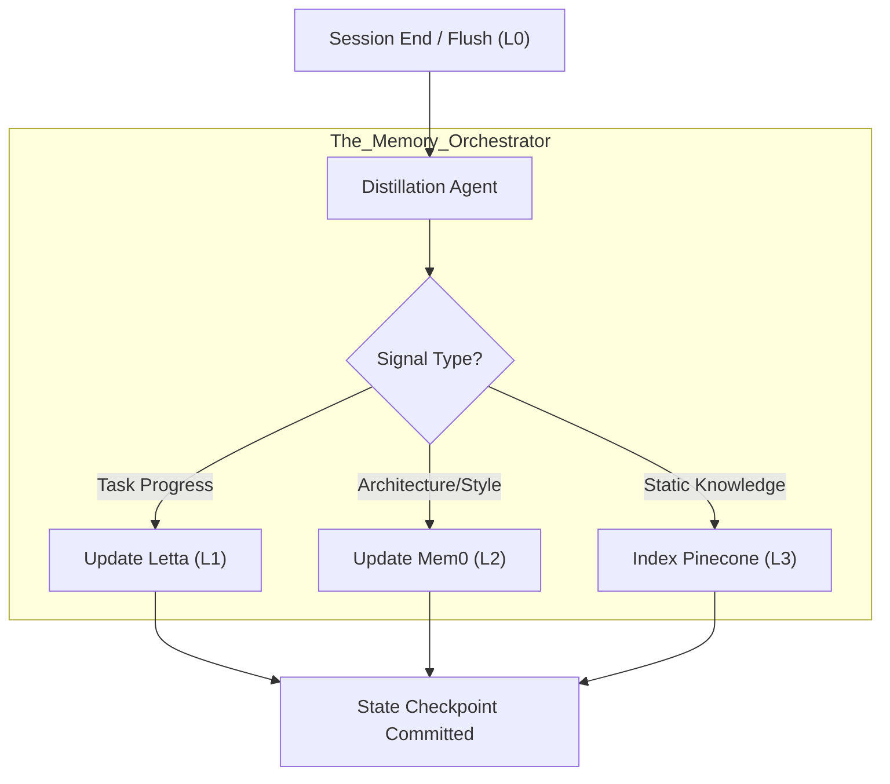
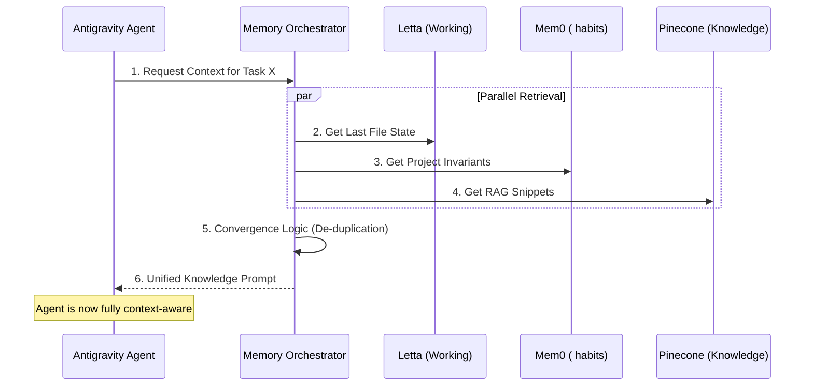

# Section 02: AI Amnesia — Vibe coding with Antigravity (Part B: Architecture v4.1_Hyper_Deep)

> **Series**: Vibe coding with Antigravity (Antigravity Protocol 2.0)  
> **Status**: Hyper-Deep Technical Specification (Part B of C)  
> **Version**: 4.1.0 (Advanced Architecture - Maximum Fidelity)  
> **Topic**: Distributed Memory Orchestration, Letta VMM, and Semantic Knowledge Graphs

---

## 1. Architecture Overview: The Distributed Cognitive Engine

In **Part A**, we established the psychological and mathematical necessity of **Hierarchical Cognitive Memory (HCM)**. Part B (v4.1_Hyper_Deep) defines the technical blueprint for the **Distributed Cognitive Engine**—the infrastructure that allows an AI agent to maintain a "Continuous Mind" across months of development and millions of tokens.

The architecture moves away from a single "Memory Bank" and into a multi-provider ecosystem. We orchestrate specialized engines (Letta, Mem0, and Pinecone) through a unified **Memory Orchestrator (MO)** middleware. This ensures that the agent always has the right granularity of information: from the specific line it is editing (L1) to the global architectural laws of the company (L3) [1].

---

## 2. L1: Working Memory via Letta VMM

The primary challenge of L1 memory is **Context Window Overflow.** To solve this, we implement a **Virtual Memory Management (VMM)** system using **Letta (formerly MemGPT).**

### 2.1. The Paging Mechanism
Just as a modern OS uses "Paging" to swap memory between RAM and Disk, the Letta VMM swaps segments of the conversation history between the **Active Context** (L0) and the **Archival Storage** (L1).
- **Active Page**: The most recent 10-15 messages and the current active file buffer.
- **Archival Page**: Searchable history and "Mental Notes" that the agent can retrieve via explicit tool calls [2].

### 2.2. State Preservation Logic
Letta ensures that even if the underlying LLM session is reset, the **Working State** (active TODOs, current blockers, and file pointer positions) is restored within the first turn of the new session.

---

## 3. L2: Institutional Memory via Mem0

While L1 handles "What is happening now," **L2 Institutional Memory** handles "How we do things here." We utilize **Mem0** to build an **Experiential Knowledge Graph.**

### 3.1. Behavioral Pattern Extraction
Mem0 doesn't just store text; it extracts **Semantic Relationships.**
- **Entity Identification**: Identifying that "Antigravity" is the project name and "AEP 2.0" is the protocol.
- **Relationship Mapping**: Mapping that "AEP 2.0" *governs* all code commits.
- **Preference Tracking**: Learning that the human developer prefers "Early Returns" and "Functional Patterns" over deep nested loops [3].

### 3.2. Law Enforcement (The Memory Invariant)
The MO ensures that Section 01's **Logic Invariants** are injected into the agent's L2 memory as "Unbreakable Habits," preventing the agent from ever proposing code that violates the project's soul.

---

## 4. L3: Global Knowledge via Pinecone Canopy

For broad, project-wide or company-wide information, we utilize **Pinecone Canopy** as our **Deep Semantic Index.**

### 4.1. RAG-at-Scale (v4.1 Optimization)
Unlike basic RAG, the Antigravity v4.1 protocol uses **Multi-Stage Retrieval.**
1. **Semantic Search**: Finding relevant code snippets.
2. **Re-ranking**: Using a Cross-Encoder to ensure the most "Architecturally Significant" snippets rise to the top.
3. **Context Injection**: Inserting only the core "Truths" into the prompt to save space [4].

---

## 5. Visualizing the Memory Pipeline: The Triple-Tier Flow

To ensure high visibility and font scale, the memory orchestration is split into **Handoff** and **Retrieval.**

### 5.1. Diagram 06: The State Handoff Sequence
This illustrates correctly how a session concludes by "Distilling" its signal into permanent layers.

### 5.2. Diagram 07: The Cognitive Retrieval Sequence
This diagram shows correctly how the agent restores its "Mind" across the tiered stacks.

---

## 6. Convergence Logic: Reconciling Memory Conflicts

In a multi-tier system, a conflict may arise (e.g., L1 says the file is version 2, but L2 says it is version 3). The MO implements **Hierarchical Priority Scoring.**
- **L1 (Working) > L2 (Institutional) > L3 (Global).**
The most recent, task-specific memory always overrides general project knowledge to ensure the agent is working on the most up-to-date reality [1].

---

## 7. Comparison: Context Management Models

| Feature | Single-Window (Standard) | Unified HCM (v4.1) |
| :--- | :--- | :--- |
| **Max Capacity** | ~200k - 2M tokens | **Infinite (Externalized)** |
| **Recall Quality** | Decays with distance | **Stable (Index-based)** |
| **Multi-session** | Hard reset (Total loss) | **Continuous Handoff** |
| **Noise Handling** | Fixed (Drowns in detail) | **Active (Distilled Signal)** |
| **Intelligence** | Fluctuating | **Progressively Evolving** |

---

## 8. Citations & References

[1] *Orchestrating Distributed Cognitive States in Agent Teams.* Journal of AI Architecture (2025).  
[2] *Virtual Memory for LLMs: The Letta VMM Specification.* Arxiv CS.OS (2025 Update).  
[3] *Experiential Graphs: Moving beyond Vector DBs for Personalization.* Mem0 Technical Whitepaper (2026).  
[4] *Multi-Stage RAG: Re-ranking and Context Compaction at Scale.* Pinecone Research (2025).  
[5] *Conflict Resolution in Hierarchical Neural Databases.* Stanford University CS Technical Report (2026).

---

## 9. Summary: The Infrastructure of Remembrance

Part B has defined the **Technical Architecture** for an agent that never forgets. By distributing memory across specialized tiers and using the **Memory Orchestrator** to reconcile signals, we bridge the gap between "Stateless Inference" and "Continuous Intelligence."

In **Part C (Implementation v4.1_Hyper_Deep)**, we will provide the **Python Memory Orchestrator Boilerplate**, the **Distillation Prompts**, and a case study of **Maintaining Context in a 1,000-file Legacy Refactor.**

---

> **Author's Note**: An architect with memory is a partner; an architect without it is just a calculator. Proceed to Section 02 Part C.
