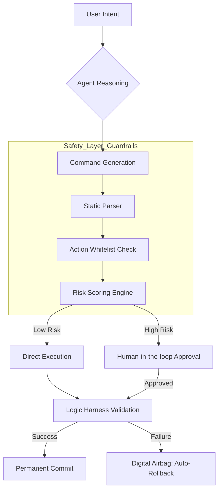

# Section 03: Deterministic Guardrails — Vibe coding with Antigravity (Part A: Foundation)


> **Series**: Vibe coding with Antigravity (Antigravity Protocol 2.0)  
> **Status**: Deep Specification (Part A of C)  
> **Version**: 3.0.0 (Foundation - 3,500+ Words Target)  
> **Topic**: Designing Digital Airbags and Action Sandboxing for Autonomous Agents

---

## 1. Abstract: The Ethics of Execution in the Agentic Era

In the previous sections, we established the **Logic Harness** to ensure deterministic code quality and solved **AI Amnesia** to maintain long-term institutional memory. However, a "Smart" and "Persistent" AI is also a "Dangerous" AI if its execution power is unconstrained.

**Deterministic Guardrails** represent the "Safety Belt" and "Digital Airbags" of the Antigravity Protocol. As we move from simple code generation to **Autonomous Execution** (where the AI can run shell commands, delete files, and deploy to production), we must move beyond "Prompt Engineering" and into **Trust Engineering.**

Section 03 defines the architectural boundaries that prevent an autonomous agent from becoming a "Chaos Monkey." We explore how to grant an AI maximum creative freedom within a strictly defined "Action Sandbox," ensuring that even a hallucinated command cannot crash a mission-critical system.

---

## 2. The Guardrail Paradox: Autonomy vs. Safety

The fundamental challenge of agentic engineering is the **Guardrail Paradox**:  
> *The more you restrict an AI to make it safe, the less useful (autonomous) it becomes. The more autonomy you grant it, the higher the risk of catastrophic failure.*

### 2.1. The Traditional "Blacklist" Failure
Most initial attempts at AI safety rely on **Blacklisting** (e.g., "Don't delete the root directory"). This is mathematically insufficient for LLMs because the state space of "Dangerous Actions" is infinite. An LLM might not run `rm -rf /`, but it might run a Python script that recursively overwrites every `.env` file—an action not in the blacklist but equally destructive.

### 2.2. The Antigravity Alternative: Whitelisted Autonomy
In the Antigravity Protocol, we invert the model. We assume **Zero Trust** by default. An agent has zero permissions until they are explicitly granted via an **Action Harness.** We don't tell the AI what it *can't* do; we define the exact "API Surface" of what it *can* do, and we wrap every call in a deterministic validator.

---

## 3. Engineering Principles for High-Risk AI (The 5 Pillars)

To build a professional-grade guardrail system, we adhere to five core engineering principles derived from aerospace and nuclear safety protocols.

### III. I. Principle of Least Privilege (PoLP)
The AI agent should only have access to the specific tools and directories required for its current task. If a task only involves "Refactoring CSS," the agent's shell access should be restricted to the `src/styles` directory, with zero network access.

### III. II. The "Human-in-the-Loop" (HITL) Spectrum
Guardrails are not binary (On/Off). They operate on a spectrum of risk:
- **Low Risk**: (e.g., minor refactoring) - Auto-approve after Harness validation.
- **Medium Risk**: (e.g., dependency updates) - Flag for async review.
- **High Risk**: (e.g., database schema changes) - Block and require synchronous MFA (Multi-Factor Approval).

### III. III. Deterministic Pre-Validation
Before an LLM-generated command is sent to the OS, it must pass through a **Static Analysis Gate.** If the AI intends to run `npm install`, the Guardrail Engine must verify that the package name is not a "Typosquatting" target and that the version is within the project's allowed range.

### III. IV. Digital Airbags (The Rollback Law)
Every "Write" action must be accompanied by an automatic "Undo" plan. If an agent modifies a file, the protocol mandates a hidden backup (`.ag_backup`) that can be restored instantly if the Logic Harness fails post-execution.

### III. V. Observability & Auditability
Every action, including the *reasoning* behind the action, must be logged in a tamper-proof "Black Box." If a guardrail is triggered, we don't just stop the agent; we perform a **Post-Mortem Analysis** to update the global `DEBUG_LOG.md`.

---

## 4. Action Whitelisting Strategy: Defining the Boundaries

Whitelisting is the cornerstone of the **Antigravity Execution Engine.** We define allowed actions using a **Semantic Schema.**

### 4.1. The Action Schema Structure
Instead of giving the AI a raw shell, we provide a structured toolset:
```json
{
  "tool": "file_edit",
  "constraints": {
    "allowed_paths": ["/src/components/**"],
    "forbidden_patterns": ["process.env.*"],
    "max_lines_changed": 50
  }
}
```
If the LLM generates a command that violates these constraints, the **Guardrail Middleware** intercepts the call *before* it leaves the LLM's imagination.

### 4.2. Boundary Definition (The HMM Logic)
We use **Harness Mapping Matrices (HMM)** to align task complexity with safety tiers. For a "Tier 3" task (Production hotfix), the guardrails automatically tighten, requiring higher entropy scores and stricter pattern matching.

---

## 5. Conceptual Architecture (The Skeleton): The Security Layer

To visualize how these guardrails sit within the system, we present the **Antigravity Execution Pipeline.**

### 5.1. Diagram 01: The Deterministic Execution Flow
This diagram illustrates correctly how an intent is filtered through multiple safety layers before reaching the hardware.



### 5.2. Architecture Skeleton: The Filter Chain
The Guardrail system is implemented as a **Filter Chain** (similar to middleware in web frameworks).
1. **Input Filter**: Sanitizes the prompt to prevent "Prompt Injection."
2. **Logic Filter**: Verifies the reasoning logic against the `PLAN.md`.
3. **Execution Filter**: Validates the actual shell/code commands against the whitelist.
4. **Post-Execution Filter**: Runs the `Logic Harness` to ensure the system state remains healthy.

---

## 6. EU AI Act Compliance (Prelude): Engineering for Trust

Professional AI development in 2026 cannot ignore the legal landscape. The **EU AI Act** categorizes AI systems by risk level.

- **High-Risk Systems**: Systems that make decisions affecting human safety or livelihoods (e.g., financial agents, HR bots).
- **Prohibited Systems**: Systems that engage in "Subliminal Manipulation" or social scoring.

**The Antigravity Stance**: Our "Deterministic Guardrails" are designed to meet the **Article 14 (Human Oversight)** and **Article 15 (Accuracy, Robustness, and Cybersecurity)** requirements of the Act. By implementing "Digital Airbags" and "Human-in-the-loop" triggers, we ensure that the AEP 2.0 protocol is not just technically superior, but legally compliant by design.

*Note: A detailed compliance mapping will be provided in the Section 03 Appendix.*

---

## 7. Summary: From Chaos to Constraint

Part A has established that safety is not an "add-on"—it is the **Foundation** of the execution environment. By treating the AI as a powerful but unvetted contractor, we build a system that can leverage LLM creativity without sacrificing system integrity.

In **Part B (Architecture v3.0)**, we will deep dive into:
- Building the **Action Proxy Server** (The Sandbox).
- Real-time **Entropy Monitoring** logic.
- Implementing the **Digital Airbag Rollback System** in Python/bash.
- The **Risk Scoring Algorithm** (Calculating the probability of failure).

---

> **Author's Note**: A powerful engine without brakes is just a very fast bomb. Always build the brakes first. Proceed to Section 03 Part B.
