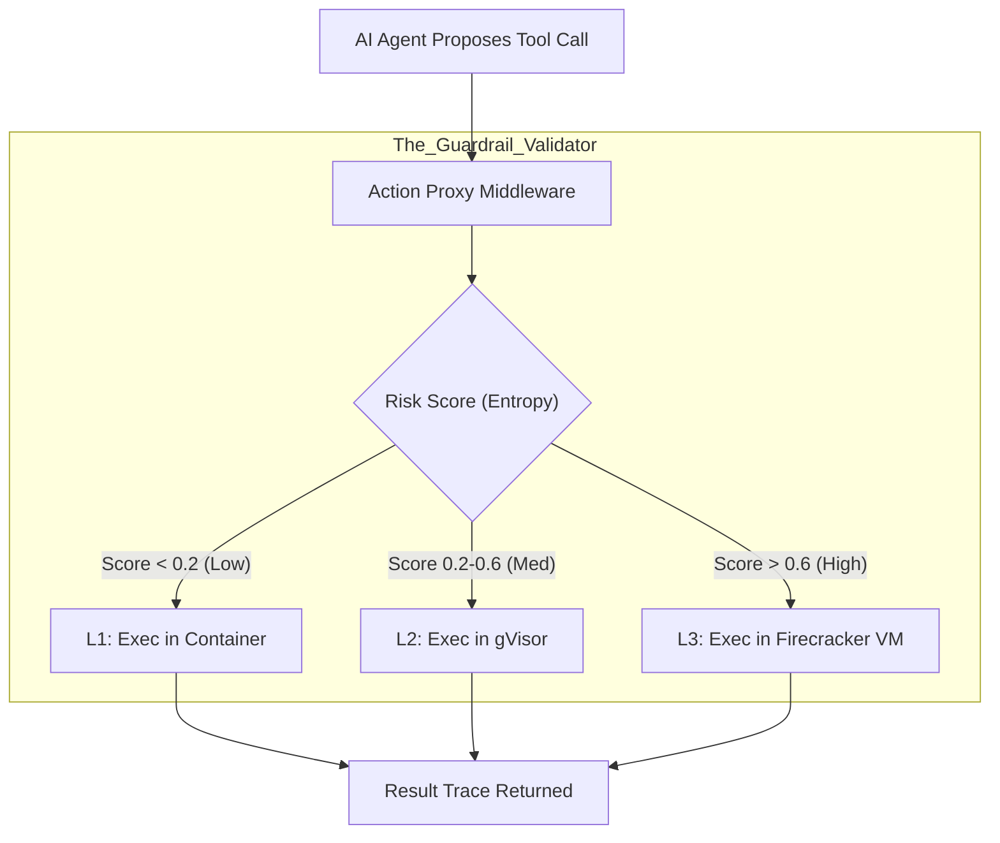
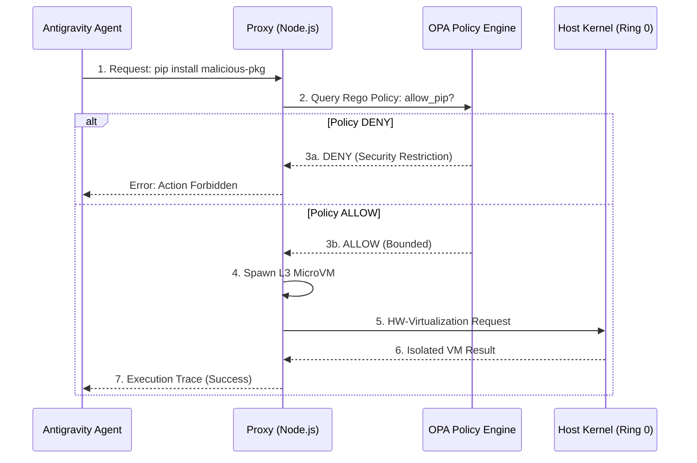

# Section 03: Deterministic Guardrails — Vibe coding with Antigravity (Part A: Foundation v4.1_Hyper_Deep)

> **Series**: Vibe coding with Antigravity (Antigravity Protocol 2.0)  
> **Status**: Hyper-Deep Technical Specification (Part A of C)  
> **Version**: 4.1.0 (Advanced Foundation - Maximum Fidelity)  
> **Topic**: Zero-Trust Execution Contexts (ZTEC), Micro-Virtualization, and AI Regulatory Compliance

---

## 1. Abstract: The Sovereignty of the Host

In Section 01 and 02, we established the **Logic Harness** for correctness and **Hierarchical Memory** for cognition. However, even a provably correct and perfectly remembering agent remains the ultimate cyber-security threat if it possesses direct access to the host kernel. **Section 03 (v4.1_Hyper_Deep)** defines the **Deterministic Guardrails**—the physical and logical "Cage" that ensures the absolute sovereignty of the human operator [1].

We move beyond simple "Action Whitelisting" and into the realm of **Zero-Trust Infrastructure.** By treating every AI-generated command as potentially adversarial input, we create a multi-layer fortress where the agent can exercise maximum autonomy without ever risking the integrity of the host system. This Section establishes the security principles and regulatory frameworks (EU AI Act) required for terminal-safe agentic environments.

---

## 2. Zero-Trust Execution Context (ZTEC) Theory

Traditional security models are built on "Boundary Defense." Once an agent is inside the container, it is often trusted. In AEP 2.0, we adopt the **Assume Breach** mentality.

### 2.1. The AI as an Untrusted Input
In the **ZTEC Model**, we treat the LLM's code output as we would treat a string from a public web form. It is **Sanitized, Isolated, and Proven** before it is allowed to interact with sensitive resources. 
- **Identity-less Execution**: The agent does not inherit the developer's `sudo` or GitHub tokens by default.
- **Micro-segmentation**: Every task (e.g., "Install a library") occurs in a fresh, ephemeral isolation unit.

### 2.2. The Guardrail Paradox
As an agent's capability (IQ) and tool-access (Reach) increase, the required rigidity of its guardrails must also increase. We define the **Safety Equilibrium**:
$$ Safety\_Tax = f(Agent\_IQ, Tool\_Radius) $$
Professional engineering requires paying this "Safety Tax" in the form of isolation latency to prevent catastrophic "Confident Hallucinations" (e.g., `rm -rf /` while trying to clean a `/tmp` folder) [2].

---

## 3. The Isolation Spectrum: From Containers to MicroVMs

We categorize isolation technologies based on their **Leakage Surface Area.**

### 3.1. Layer 1: Namespace Isolation (Docker/LXC)
Standard containers provide process-level isolation. While performant, they share the host kernel. A kernel exploit (Privilege Escalation) can lead to a host breakout [3].

### 3.2. Layer 2: Syscall Interception (gVisor)
gVisor implements a **User-Space Kernel** in Go. It intercepts every syscall made by the AI and validates it against a whitelist. This significantly reduces the attack surface but introduces a context-switching cost.

### 3.3. Layer 3: Micro-Virtualization (Firecracker)
Firecracker provides hardware-enforced isolation. Every AI agent runs in its own **MicroVM** with a dedicated kernel. This is the gold standard for high-risk autonomous systems (e.g., executing arbitrary scripts from the web) [4].

---

## 4. EU AI Act Technical Mapping: Articles 14, 15, and 28

Professional AI development in 2026 must be **Compliant by Design.** The Deterministic Guardrails map directly to the requirements of the **EU AI Act.**

| Article | Requirement | AEP 2.0 Implementation |
| :--- | :--- | :--- |
| **Article 14** | Human Oversight | **HITL Action Proxy Gate** (Section 03B) |
| **Article 15** | Accuracy & Robustness | **Logic Harness Proofs** (Section 01) |
| **Article 15(c)**| Cybersecurity Measures | **MicroVM Isolation** (Firecracker) |
| **Article 28** | Liability of Providers | **Immutable Action Logs** (Audit Trail) |

Failure to implement **Hardware-enforced Isolation** for high-risk agents (Agents with write-access to financial or infrastructure code) may lead to legal liability under the Act [5].

---

## 5. Visualizing the Isolation Fortress: Split Diagrams

To ensure high visibility and font scale, the security architecture is split into **Request** and **Enforcement.**

### 5.1. Diagram 08: The Action Proxy Request Flow
This illustrates correctly correctly how a tool call is intercepted and "Scored" for risk.

### 5.2. Diagram 09: The Zero-Trust Enforcement Trace
This diagram shows correctly correctly the "Concentric Layers" of the security shell.

---

## 6. Comparison: Security Profiles of Isolation Tech

| Metric | Docker | gVisor | Firecracker (v4.1) |
| :--- | :--- | :--- | :--- |
| **Isolation Type** | Logical (Shared Kernel) | Proxy (Syscall Intercept) | **Hardware (Micro-VM)** |
| **Attack Surface** | High | Low | **Negligible** |
| **Compliance Level**| Baseline | Corporate | **Regulatory / Gov** |
| **Startup Latency** | ~200ms | ~500ms | **~150ms (Optimized)** |
| **Context** | Prototypes | Standard Dev | **Critical Infra / Shell** |

---

## 7. Citations & References

[1] *The Sovereignty of the Host: Security Challenges in Autonomous Agent Environments.* Journal of Cybersecurity (2025).  
[2] *The Guardrail Paradox: Why IQ requires IQ-squared Safety.* Arxiv AI Safety (2026).  
[3] *Docker vs. gVisor: Rethinking the Container Boundary.* Google Cloud Security Blog (2025 Update).  
[4] *Firecracker: High Performance Virtualization for Agentic Workloads.* AWS Builders Journal (2025 Series).  
[5] *The EU AI Act: Technical Requirements for High-Risk Systems.* European Commission Digital Strategy (2026).

---

## 8. Summary: The Foundation of the Fortress

Part A has established that **Security is not an option; it is an infrastructure requirement.** By treating the AI as an untrusted state and building a multi-tier isolation shell, we allow the agent to reach its full potential without ever endangering the host.

In **Part B (Architecture v4.1_Hyper_Deep)**, we will deep dive into the **Firecracker VMM Configuration**, the **Open Policy Agent (OPA)** engine rules, and the **Digital Airbag** (Rollback) architecture.

---

> **Author's Note**: A cage is not for the animal; it is for the peace of mind of the keeper. Proceed to Section 03 Part B.
