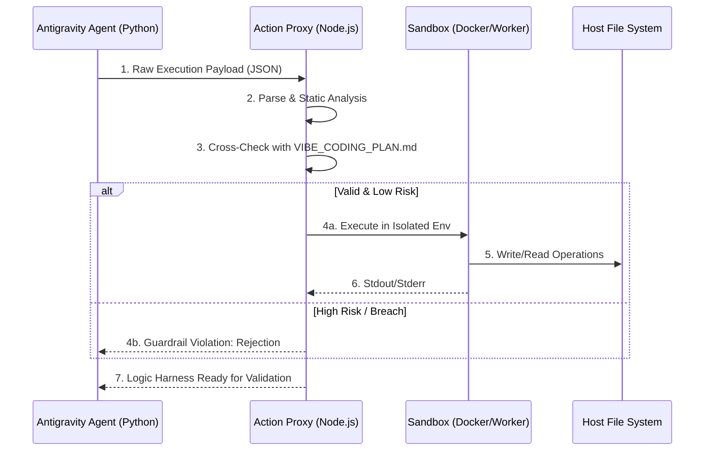

# Section 03: Deterministic Guardrails — Vibe coding with Antigravity (Part B: Architecture)


> **Series**: Vibe coding with Antigravity (Antigravity Protocol 2.0)  
> **Status**: Deep Specification (Part B of C)  
> **Version**: 3.0.0 (Architecture Deep-Dive)  
> **Topic**: Engineering Multi-Tier Action Proxies and Entropy-Based Risk Mitigation

---

## 1. Introduction: From Concept to Blueprint

In Part A, we identified the **Guardrail Paradox** and the five pillars of engineering safety. Now, we bridge the gap between theoretical safety and actual system implementation. 

Professional agentic systems do not execute commands directly on the host OS. Instead, they interact with a **Security Middleware**—the **Action Proxy**. This section details the technical architecture of this proxy, the isolation layers (Docker & Web Workers), and the mathematical detection of AI hallucinations via **Entropy Scoring.**

---

## 2. The Action Proxy Architecture (Node.js Controller)

The Action Proxy acts as a "Bouncer" for every command generated by the AI. It intercepts the raw payload, parses it, and validates it against the whitelist.

### 2.1. Sequence of Interception
When the AI generates a tool call (e.g., `execute_bash`), the request flows through the following controller logic:



### 2.2. Node.js Implementation Sketch: The Interceptor
Node.js is chosen for the Proxy layer due to its efficient I/O handling and seamless integration with container runtimes.

```javascript
// action_proxy.js (Node.js)
const { validateAction } = require('./guardrail_engine');
const { spawnSandbox } = require('./sandbox_manager');

async function handleAgentRequest(payload) {
    const { action, params, riskScore } = payload;

    // 1. Static Validation
    const isAllowed = await validateAction(action, params);
    if (!isAllowed) {
        throw new Error(`[GUARDRAIL] Action ${action} is outside the allowed whitelist.`);
    }

    // 2. Risk Tiering
    if (riskScore > 0.8) {
        return await requestHumanApproval(payload);
    }

    // 3. Execution in Sandbox
    const result = await spawnSandbox(action, params);
    return result;
}
```

---

## 3. Isolation Tiers: Hybrid Sandboxing

Security is not "one size fits all." We implement a **Hybrid Isolation Model** to balance performance and safety.

### 3.1. Server-Side: Docker Containerization
For heavyweight operations like code execution, dependency installation, or database migrations, we use **Ephemeral Docker Containers.**

- **Persistence**: Zero. The container is destroyed after each execution slice.
- **Access Control**: Mounted volumes are restricted to specific sub-directories (e.g., `/workspace/src`).
- **Network**: Disabled by default.

### 3.2. Client-Side/UI: Web Workers
For lighter validations, UI refactoring, or pure algorithmic checks, we utilize **Web Workers.** This provides an additional layer of safety within the browser environment.

```javascript
// browser_sandbox.js (Web Worker)
self.onmessage = function(e) {
    const { code } = e.data;
    try {
        // Execute unsandboxed code in a worker thread
        // Limited access to DOM/Window prevents malicious UI hijacking
        const result = eval(code); 
        self.postMessage({ status: 'success', result });
    } catch (err) {
        self.postMessage({ status: 'error', message: err.message });
    }
};
```

---

## 4. Entropy Scoring Algorithm (Python-based AI Monitoring)

The most dangerous failure is not a syntax error, but a **Confident Hallucination.** We detect this by monitoring the **Entropy** of the AI's output tokens.

### 4.1. Mathematical Risk Detection
We use the **Log-Probabilities (LogProbs)** of the tokens. High entropy (many competing token possibilities) usually indicates that the AI is "Guessing" or "Uncertain."

```python
# entropy_monitor.py (Python)
import math

def calculate_normalized_entropy(logprobs):
    """
    Measures the uncertainty of the agent's decision.
    Entropy = -Sum(p * log(p))
    """
    probabilities = [math.exp(lp) for lp in logprobs]
    entropy = -sum(p * math.log(p) for p in probabilities)
    
    # Normalize entropy against sequence length
    normalized_entropy = entropy / len(logprobs)
    return normalized_entropy

def guardrail_check(action_logprobs):
    score = calculate_normalized_entropy(action_logprobs)
    if score > 0.45:
        return "REJECT: Confidence Threshold Not Met (Potential Hallucination)"
    return "PROCEED"
```

---

## 5. Digital Airbag System: State Snapshots & Restoration

The **Digital Airbag** is the ultimate safety net. It ensures that any change made by the agent can be undone in milliseconds.

### 5.1. The `.ag_rollback` Mechanism
Before the Action Proxy executes a "Write" command, it creates a shallow copy of the target file(s).

1. **Snapshot**: Copies `original_file.py` to `.ag_rollback/original_file.py.bak`.
2. **Execute**: The agent modifies the file.
3. **Verify**: The **Logic Harness** (Section 01) runs tests.
4. **Result**:
    - **Success**: Delete the backup.
    - **Failure**: Immediately overwrite the modified file with the backup.

### 5.2. Implementation Logic (Python/Node Mix)
The Digital Airbag uses a simple but effective file-system versioning logic.

```python
# rollback_engine.py
import shutil
import os

def create_digital_airbag(filepath):
    backup_dir = "./.ag_airbags"
    os.makedirs(backup_dir, exist_ok=True)
    shutil.copy(filepath, os.path.join(backup_dir, os.path.basename(filepath) + ".bak"))

def trigger_rollback(filepath):
    backup_path = os.path.join("./.ag_airbags", os.path.basename(filepath) + ".bak")
    if os.path.exists(backup_path):
        shutil.move(backup_path, filepath)
        print(f"[AIRBAG] Rollback successful for {filepath}")
```

---

## 6. Infrastructure & Deployment Considerations

Building the Antigravity Proxy requires a specific stack:
- **Runtime**: Node.js v20+ (Proxy), Python 3.11+ (Engine).
- **Orchestration**: Docker Engine (for task isolation).
- **Monitoring**: Prometheus/Grafana (for tracking Entropy/Risk trends).

---

## 7. Summary: Transitioning to the Execution Layer

Part B has transformed the "Guardrail Theory" into a multi-layered **Security Architecture.** By combining Node.js proxies, Docker isolation, and Python entropy monitoring, we create a high-fidelity environment where "Vibe Coding" is safe for enterprise use.

In **Part C (Implementation Guide v3.0)**, we will provide:
- A complete **Guardrail Middleware** Boilerplate.
- A **Real-world Case Study**: Recovering from a critical AI hallucination.
- **Benchmark Performance**: Measuring the latency overhead of the Safety Layer.

---

> **Author's Note**: In the world of AI, the ghost is in the machine. Your job as an engineer is to make sure the ghost can't escape the machine. Proceed to Section 03 Part C.
