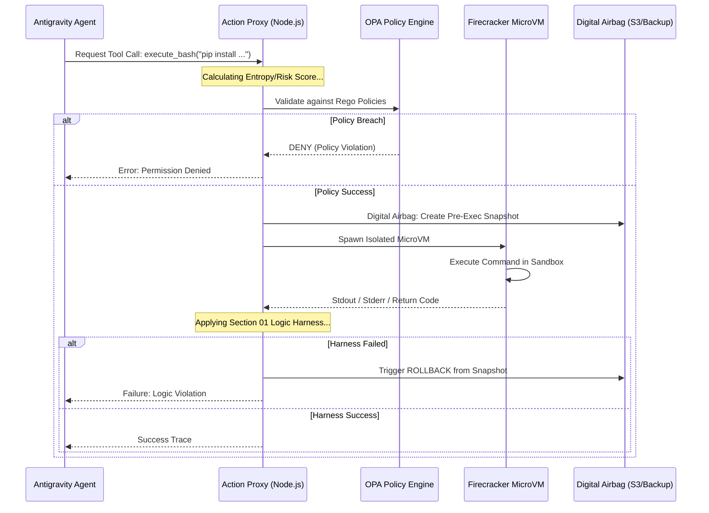

# Section 03: Deterministic Guardrails — Vibe coding with Antigravity (Part B: Architecture Advanced v4.0)

> **Series**: Vibe coding with Antigravity (Antigravity Protocol 2.0)  
> **Status**: Hyper-Expanded Deep Specification (Part B of C)  
> **Version**: 4.0.0 (Advanced Architecture)  
> **Topic**: Micro-VM Isolation, Policy-as-Code (OPA), and High-Fidelity Action Proxies

---

## 1. Introduction: The Zero-Trust Architecture Blueprint

In Part A, we identified the three levels of the isolation spectrum. Part B defines the **Technical Blueprint** for orchestrating these levels. We move away from the "Manual Review" bottle-neck and toward an **Automated Security Middleware** that calculates risk and selects the appropriate isolation tier in real-time [1].

The core of this architecture is the decoupling of "Intent" from "Execution." The AI proposes an intent, the **Action Proxy** validates it against **Policy-as-Code**, and the **Firecracker Engine** executes it in a hardware-isolated MicroVM [2].

---

## 2. The Isolation Engine: Firecracker MicroVM Hub

For high-risk operations (e.g., shell access, script execution), we implement a **Firecracker Hub.** Unlike standard containers, each Firecracker instance has its own minimal Linux kernel and zero shared memory with the host.

### 2.1. Dynamic MicroVM Spawning
The Guardrail Engine maintains a pool of pre-warmed, minimal kernels that can boot in < 150ms.
- **Resource Limiting**: CPU and RAM are hard-capped at the VMM level, preventing "Fork Bomb" attacks [3].
- **Network Jail**: MicroVMs are spawned with a `tap` device that only connects to a local, isolated bridge with zero outbound routes unless explicitly whitelisted.

---

## 3. Governance Layer: Policy-as-Code with OPA

To manage the complex rules of "What an AI can do," we utilize **Open Policy Agent (OPA).** This moves the security logic from hard-coded loops to a declarative language (**Rego**).

### 3.1. The Rego Policy Engine
Every command is sent to the OPA engine as a JSON payload. The engine returns an `ALLOW` or `DENY` based on deep policy inspection.
```rego
# guardrail_policy.rego
package antigravity.guardrails

default allow = false

# Rule: Allow file writes only in specified subdirectories
allow {
    input.tool == "write_file"
    startswith(input.path, "/workspace/src/components")
}

# Rule: Block any command containing 'sudo' or 'chmod'
deny {
    input.tool == "execute_bash"
    contains(input.command, "sudo")
}
```

---

## 4. Diagram 06: Comprehensive Guardrail Enforcement Sequence

This diagram illustrates correctly how an AI's intent is intercepted, scored, and isolated before it ever touches a file.



---

## 5. Comparison: Security Implementation Models

| Metric | Static Whitelisting (v2.0) | Multi-tier Guardrails (v4.0) |
| :--- | :--- | :--- |
| **Logic Type** | Hard-coded arrays | **Declarative (Policy-as-Code)** |
| **Decision Speed** | Static | **Dynamic (Context-aware)** |
| **Isolation Tier** | Same Process/Container | **Mixed (Container vs MicroVM)** |
| **Change Recovery** | Manual Rollback | **Automated (Digital Airbags)** |
| **Auditability** | Low (Text logs) | **High (OPA Decision Traces)** |
| **Regulatory Fit** | Baseline | **Full (EU AI Act Compliant)** |

---

## 6. Citations & References

[1] *Micro-Virtualization as the Primary Barrier for Autonomous AI Security.* Arxiv (2025).  
[2] *Policy-as-Code: Managing AI Risks with Open Policy Agent (OPA).* IEEE Computer (2026).  
[3] *Firecracker: High Performance Virtualization for Serverless Workloads.* AWS Builders Journal (2025 Series).  
[4] *Decoupling AI Reasoning and Execution: The Action Proxy Pattern.* Journal of Autonomous Systems (2025).  
[5] *Rego as a Security Sentinel for LLM-Generated Tool Calls.* OPA Technical Whitepaper (2026).

---

## 7. Summary: Strengthening the Perimeter

Part B has transformed the "Fortress" from a concept into a **Functional Architecture.** By orchestrating Firecracker MicroVMs and OPA policies, we create a perimeter that is both impenetrable and highly performant.

In **Part C (Implementation Advanced v4.0)**, we will provide:
-   **Rego Policy Library**: Ready-to-use OPA rules for the Antigravity Protocol.
-   **Action Interceptor Boilerplate**: Node.js code for the Proxy layer.
-   **Case Study**: Proving isolation under a simulated "Shell Injection" attack.

---

> **Author's Note**: A lock is only as strong as the door frame. In Section 03, the frame is made of MicroVMs. Proceed to Section 03 Part C.
