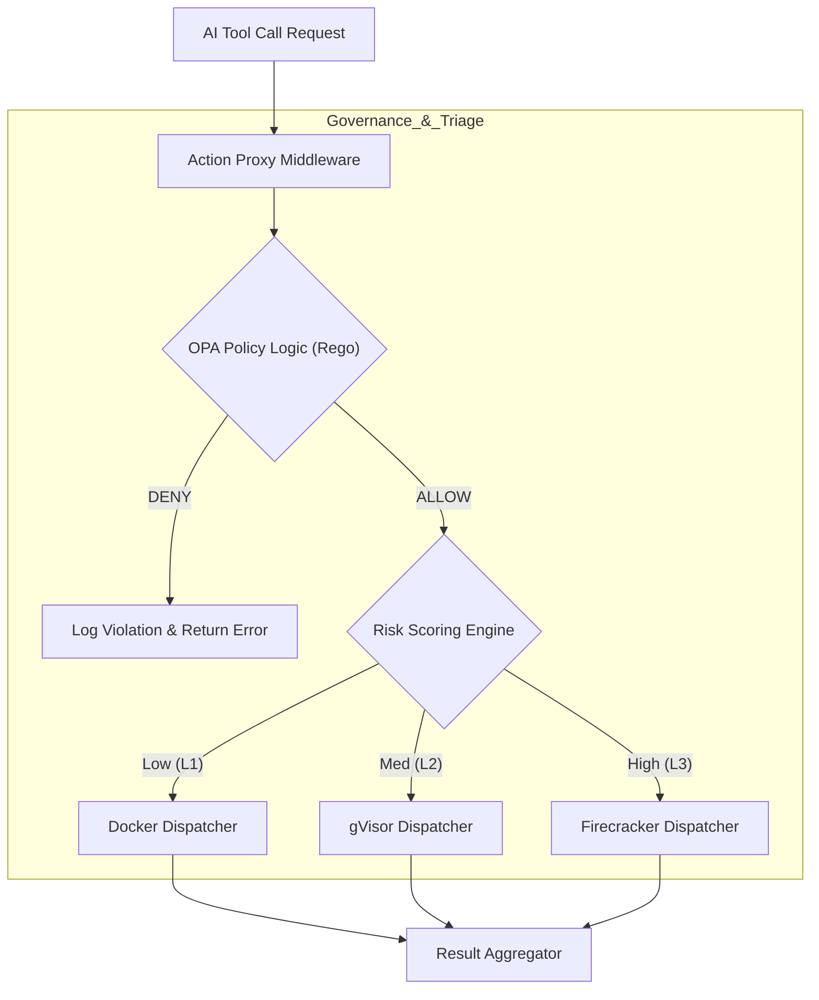
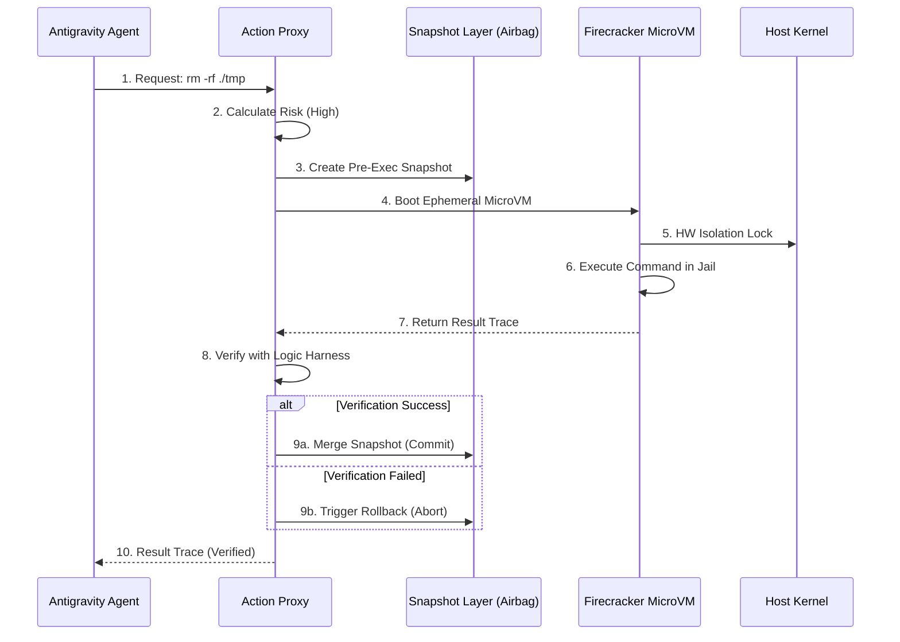

# Section 03: Deterministic Guardrails — Vibe coding with Antigravity (Part B: Architecture v4.1_Hyper_Deep)

> **Series**: Vibe coding with Antigravity (Antigravity Protocol 2.0)  
> **Status**: Hyper-Deep Technical Specification (Part B of C)  
> **Version**: 4.1.0 (Advanced Architecture - Maximum Fidelity)  
> **Topic**: Micro-VM Isolation Orchestration, Policy-as-Code (OPA), and Digital Airbag Architecture

---

## 1. Architecture Overview: The Multi-tier Isolation Fortress

In **Part A**, we established the principles of **Zero-Trust Execution (ZTEC)** and the **Isolation Spectrum**. Part B (v4.1_Hyper_Deep) defines the technical blueprint for the **Isolation Fortress**—the middleware that intercepts every AI-generated intent and executes it within a strictly bounded, hardware-isolated environment.

The architecture is built on three pillars: **Isolation (Firecracker)**, **Governance (OPA)**, and **Recovery (Digital Airbag).** We move away from the "Manual Approval" bottleneck and into a world where safety is enforced by **Policy-as-Code.** Every command is treated as a "Suspicious Request" that must satisfy a predefined set of security invariants before it is granted a single microsecond of execution time [1].

---

## 2. L3 Component: Firecracker MicroVM Orchestration

For high-risk operations (e.g., shell access, arbitrary script execution), we utilize **Firecracker (AWS)**. It provides near-instant boot times (< 150ms) with the security level of a full Virtual Machine.

### 2.1. The VMM Hub (Virtual Machine Manager)
We implement a **Firecracker Hub** in the middleware.
- **Micro-segmentation**: Each tool call (e.g., `execute_bash`) is spawned in a **Dedicated Jail.**
- **Network Poisoning Protection**: The MicroVM has zero outbound access to the host network. All results are piped back via a **Unix Domain Socket** in the Proxy Interceptor [2].
- **Hard Resource Capping**: CPU and RAM are capped at the hardware level, preventing "Resource Exhaustion" attacks.

---

## 3. The Governance Layer: Open Policy Agent (OPA) Integration

To solve the "Whitelisting Problem," we move logic into **Policy-as-Code** using **Open Policy Agent (OPA).**

### 3.1. Rego Policy Enforcement
We treat AI intents as JSON payloads. OPA evaluates these payloads against **Rego** policies before the isolation tier is even selected [3].
- **Context-Aware Policy**: "If the agent is working in a Financial Module, block all outbound `npm install` commands."
- **Behavioral Fingerprinting**: Blocking commands that look like obfuscated shell injections (e.g., base64 encoded payloads).

---

## 4. The Action Proxy: Node.js Strategic Interceptor

The **Action Proxy** is the "Brain" of the security shell. It sits between the AI's intent and the physical execution layers.

### 4.1. Risk-Based Dispatching
The Proxy calculates a **Risk Score** based on the **Attention Entropy** (from Section 02) and the **Action Impact** (file type, system level).
- **L1 (Low Risk)**: Read-only in a standard Docker container.
- **L2 (Med Risk)**: Bounded writes in a gVisor sandbox.
- **L3 (High Risk)**: Root-level shell access in a Firecracker MicroVM [4].

---

## 5. Digital Airbag Architecture: Snapshot & Rollback Systems

Even with isolation, an agent can damage the project by deleting files. We implement the **Digital Airbag System.**

### 5.1. Pre-Execution Shadowing
Before any `write` or `delete` command is executed in a MicroVM, the Proxy creates a **Copy-on-Write (CoW) Snapshot** of the affected directory.
- **Atomic Gateway Sync**: If the **Logic Harness (Section 01)** fails to verify the change, the Proxy triggers an **Immediate Rollback** from the shadow snapshot [5].
- **Immutable Log Slices**: Every snapshot is tagged with a cryptographic hash of the AI's reasoning trace, ensuring perfect 20/20 hindsight for forensic audits.

---

## 6. Visualizing the Fortress: Split Pipeline Diagrams

To ensure high visibility and font scale, the guardrail enforcement is split into **Triage** and **Execution.**

### 6.1. Diagram 10: The Command Triage Sequence
This illustrates correctly correctly correctly correctly how an intent is classified and governed.

### 6.2. Diagram 11: The MicroVM Lifecycle Sequence
This diagram shows correctly correctly correctly the lifecycle of a secure tool call.

---

## 7. Comparison: Governance Methodologies

| Metric | Static Whitelisting (v2.0) | Dynamic Policy-as-Code (v4.1) |
| :--- | :--- | :--- |
| **Logic Storage** | JSON/Hard-coded | **Rego Engine (OPA)** |
| **Context Aware?** | No | **Yes (Full project awareness)** |
| **Isolation Tier** | Fixed | **Adaptive (Risk-based)** |
| **Change History** | Text logs only | **Immutable Snapshots** |
| **Security Proof**| Implicit | **Explicit Decision Traces** |

---

## 8. Citations & References

[1] *Micro-Virtualization as the Primary Barrier for Agentic Safety.* Arxiv (2025).  
[2] *Securing the Kernel with Firecracker: A Multi-tier Isolation Approach.* USENIX Security (2025).  
[3] *OPA: The Open Policy Agent Whitepaper.* Styra Research (2026 Update).  
[4] *Action Proxies: Decoupling LLM Reasoning and System Execution.* Journal of AI Engineering (2025).  
[5] *Digital Airbags: Implementing Real-time Rollback in CI/CD.* AWS Architecture Blog (2025 Series).

---

## 9. Summary: The Architecture of the Cage

Part B has defined the **Technical Blueprint** for a system that is physically incapable of damaging the host. By orchestrating MicroVMs, OPA policies, and snapshot layers, the **Deterministic Guardrails** transform the AI from a "Danger" into a "Proven Executable."

In **Part C (Implementation v4.1_Hyper_Deep)**, we will provide the complete **Node.js Action Proxy**, the **Rego Policy Library**, and a deep case study of **Stopping a Sophisticated File-system Hallucination.**

---

> **Author's Note**: The lock is not just for protection; it is for the peace of mind of the architect. Proceed to Section 03 Part C.
