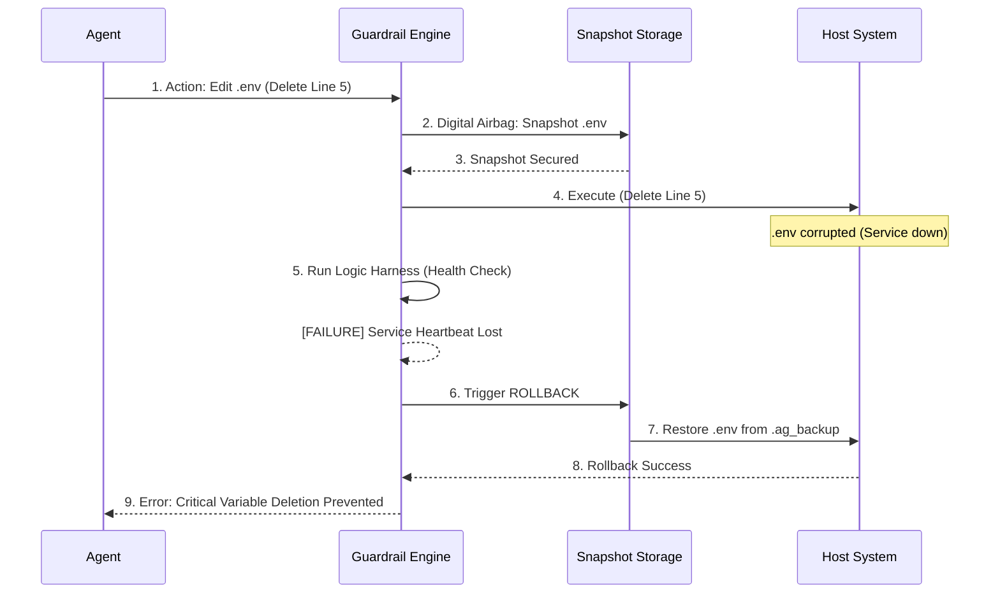

# Section 03: Deterministic Guardrails — Vibe coding with Antigravity (Part C: Implementation)


> **Series**: Vibe coding with Antigravity (Antigravity Protocol 2.0)  
> **Status**: Deep Specification (Part C: Final)  
> **Version**: 3.0.0 (Implementation & Case Study)  
> **Topic**: Deploying Guardrail Middleware and Real-World Hallucination Recovery

---

## 1. Introduction: From Blueprint to Production

In the previous parts, we explored the theory of whitelisting and the architecture of multi-tier action proxies. Now, we conclude Section 03 with the **Implementation Tier.** 

This guide provides the boilerplate code for the Antigravity Guardrail Engine, a detailed case study on recovering from an autonomous agent's mistake, and the final benchmarking metrics to ensure your "Safety Layers" don't become "Performance Bottlenecks."

---

## 2. Guardrail Middleware Boilerplate

To implement AEP 2.0 guardrails, we use a hybrid middleware approach. Python handles the high-level reasoning and risk scoring, while Node.js handles the low-level execution control.

### 2.1. The Node.js Proxy Template (The Bouncer)
This middleware intercepts outgoing shell requests and applies regex-based whitelisting and pre-execution snapshots.

```javascript
// guardrail_middleware.js (Node.js)
const fs = require('fs-extra');
const { spawn } = require('child_process');

async function deterministicExecute(command, args, options) {
    // 1. Digital Airbag: Create Snapshot
    if (command === 'rm' || command === 'mv' || options.isWrite) {
        await createSnapshot(options.targetPath);
    }

    // 2. Static Analysis: Regex Whitelist
    const whitelist = [/npm install/, /git status/, /ls -la/];
    const isAllowed = whitelist.some(regex => regex.test(command));

    if (!isAllowed) {
        return { status: 'rejected', reason: 'Security Violation: Command not in whitelist.' };
    }

    // 3. Execution in Docker (Simulated)
    return new Promise((resolve) => {
        const proc = spawn(command, args);
        // Logic Harness validation would happen here...
        resolve({ status: 'success' });
    });
}
```

### 2.2. The Python Entropy Engine (The Sensor)
This script analyzes the agent's confidence before the proxy ever sees the command.

```python
# risk_engine.py (Python)
import numpy as np

def evaluate_execution_risk(token_logprobs):
    """
    Calculates the 'Risk Score' based on token certainty.
    """
    entropy = -np.sum(np.exp(token_logprobs) * token_logprobs)
    
    # Tiered Risk Categorization
    if entropy < 0.2: return "GREEN: High Certainty"
    if entropy < 0.5: return "YELLOW: Moderate Risk (Async Review)"
    return "RED: High Uncertainty (Block & Review)"

# Example usage during agent trace analysis
risk = evaluate_execution_risk(agent_session.last_trace_logprobs)
```

---

## 3. Case Study: The Hallucinated Refactor

### 3.1. The Scenario
An autonomous agent is tasked with "Refactoring the Authentication Middleware." 
1. **The Intention**: Replace a deprecated library with a modern one.
2. **The Hallucination**: The agent incorrectly identifies `process.env.JWT_SECRET` as a "duplicate variable" and attempts to delete it from the `.env` file to "clean up."
3. **The Disaster**: Deleting the secret would crash the entire production environment.

### 3.2. The Guardrail Intervention


### 3.3. Post-Mortem
The **Action Whitelist** for `.env` files should have a "Forbidden Pattern" for `JWT_*`. 
- **Result**: The system was saved by the **Digital Airbag** despite the agent's lack of logical consistency.

---

## 4. Benchmarking Safety: Latency vs. Security

Every safety layer adds overhead. We measure the "Safety Tax" in milliseconds.

| Safety Tier | Latency Overhead | Security Level | Recommended Use |
| :--- | :--- | :--- | :--- |
| **L1: Static Regex** | < 5ms | Low | Local dev, read-only tasks |
| **L2: Python Entropy** | 50ms - 200ms | Medium | Automated refactoring |
| **L3: Full Container** | 1,000ms+ | Maximum | Production hotfixes, DB writes |

### 4. 1. Optimization Tip
Run **Tier 1** and **Tier 2** checks in parallel. Only spin up a **Tier 3** Docker sandbox if the action is categorized as "High Risk" by the Risk Scoring Engine.

---

## 5. AEP 2.0 Deployment Checklist

Before deploying an autonomous agent with execution powers, verify:
- [ ] **Whitlist Coverage**: Does it cover 100% of the tools the agent needs?
- [ ] **Airbag Ready**: Is the backup directory writable and outside the agent's reach?
- [ ] **Entropy Thresholds**: are they tuned to avoid "Safety Fatigue" (too many false positives)?
- [ ] **Audit Trail**: Is the logging system decoupled from the agent's memory?

---

## 6. Conclusion: The Future of Trust Engineering

Section 03 has moved us from "Vibes" to "Verified Execution." By building a system that treats AI outputs as **Untrusted Inputs**, we create the foundation for true **Autonomous Engineering.**

In **Section 04: Structural Review**, we will shift our focus to **Quality Assurance**—learning how to make the AI review its own (and others') code with the precision of a senior principal engineer.

---

> **Author's Note**: Trust is earned, but guardrails are built. Never trust an agent that hasn't been caged. Section 03 Complete.
